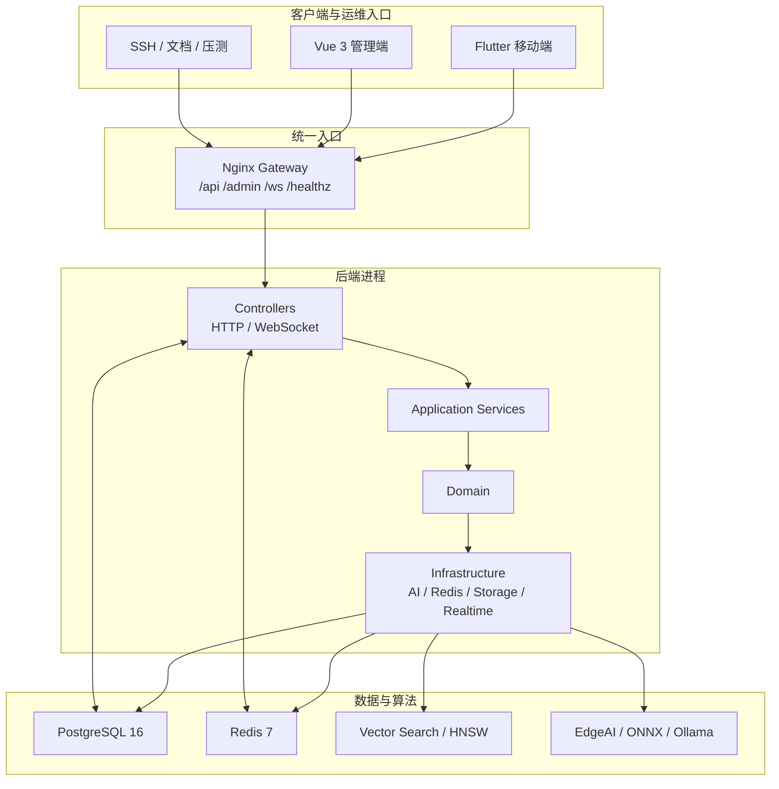

# HeartLake

HeartLake 是一套运行中的匿名情绪社区系统。当前形态是三端联动架构：Flutter 移动端负责用户互动，Vue 3 管理端负责运营治理，Drogon + C++20 后端统一承载 HTTP、WebSocket、推荐、AI、关怀和数据存储能力。

## 当前线上事实

- 公网入口：`http://121.41.195.165`
- API：`http://121.41.195.165/api`
- 管理后台：`http://121.41.195.165/admin/`
- WebSocket：`ws://121.41.195.165/ws/broadcast`
- 云端仓库目录：`/root/HeartLake`
- 部署别名：`heartlake-server`
- 移动端 release 包：`frontend/build/app/outputs/flutter-apk/app-release.apk`
- 当前 APK SHA-256：`9654d5facf294ab1c0d21e6ce6f73728d346977994fe911a23be1de02553ac31`

## 当前架构



## 当前能力

| 模块 | 当前状态 |
|---|---|
| 石头 / 涟漪 / 纸船 | 统一走网关、集合壳和实时事件链 |
| 好友 / 临时好友 | 自动关系模型生效，消息链与列表链可用 |
| 情绪日历 / 热力图 / 脉搏 | 只消费真实情绪数据，不用默认值伪装成功 |
| 推荐 / 高级推荐 / 共鸣搜索 | 直接使用当前高级算法和向量检索结果 |
| 湖神 / 守护 / 安全港 / 咨询 / VIP | 全部保留显式错误与显式降级语义 |
| 管理后台 | Dashboard、审核、用户、配置、日志、实时广播可用 |

## 当前性能快照

最近一次云端压测直接在服务器本机执行，结果如下：

- 5 分钟混合 HTTP soak：`406572` 请求，整体 `1330.91 rps`
- `GET /api/lake/stones`：平均 `8.52ms`，`p95 16.61ms`
- `GET /api/account/info`：平均 `8.27ms`，`p95 16.32ms`
- `GET /api/recommendations/trending`：平均 `7.81ms`，`p95 15.95ms`
- `GET /api/stones/{id}/resonance`：平均 `11.33ms`，`p95 19.45ms`
- `POST /api/stones/{id}/ripples`：平均 `9.77ms`，`p95 17.77ms`
- WebSocket `120` 并发连接：`120/120` 建连成功，握手平均 `42.67ms`，`p95 51.62ms`
- 压测窗口内 PostgreSQL 没有出现超过 `20ms` 的慢 SQL

## 仓库结构

- `frontend/`：Flutter 移动端
- `admin/`：Vue 3 管理端
- `backend/`：Drogon + C++20 后端
- `docs/`：现行手册与上线文档
- `scripts/`：部署、验证、联调、压测辅助脚本
- `datasets/`：离线参考数据说明

## 常用命令

```bash
# 云端登录与健康检查
ssh heartlake-server
curl -fsS http://121.41.195.165/api/health
curl -I -fsS http://121.41.195.165/admin/

# 本地全量校验
./scripts/verify-2c2g.sh
./scripts/docker-test.sh

# 云端部署
./scripts/docker-up.sh server-lite
./scripts/docker-up.sh server-lite-backend
./scripts/docker-up.sh server-lite-admin
```

## 文档入口

- [文档索引](docs/README.md)
- [技术实现全景手册](docs/04_技术实现全景手册.md)
- [后端代码地图与启动链手册](docs/11_后端代码地图与启动链手册.md)
- [移动端代码地图与状态链手册](docs/12_移动端代码地图与状态链手册.md)
- [管理端代码地图与运营链手册](docs/13_管理端代码地图与运营链手册.md)
- [数据模型与迁移手册](docs/14_数据模型与迁移手册.md)
- [配置与环境变量手册](docs/15_配置与环境变量手册.md)
- [AI、推荐与后台任务手册](docs/16_AI推荐与后台任务手册.md)
- [API 接口全量清单](docs/05_API接口全量清单.md)
- [测试验证与压测手册](docs/06_测试验证与压测手册.md)
- [上线检查清单](docs/10_上线检查清单.md)
- [Ubuntu 2C2G 部署手册](docs/deploy-ubuntu-2c2g.md)
