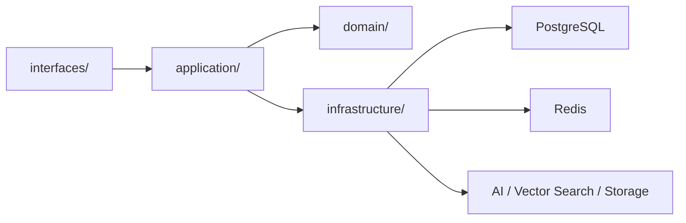

# 后端说明

当前后端是 Drogon + C++20 单体服务，统一承载 API、实时链、推荐链、AI 链和管理链。

## 当前入口

- API：`http://121.41.195.165/api`
- 管理 API：`http://121.41.195.165/api/admin`
- WebSocket：`ws://121.41.195.165/ws/broadcast`

## 当前分层



## 当前构建

```bash
cd backend
cmake -S . -B build-2c2g -DCMAKE_BUILD_TYPE=Release
cmake --build build-2c2g -j2
```

## 当前运行条件

- 必须提供 `PASETO_KEY`
- 必须提供 `ADMIN_PASETO_KEY`
- 必须提供 `DB_PASSWORD`
- 必须提供 `REDIS_PASSWORD`
- 推荐提供 `PUBLIC_API_URL`
- 推荐提供 `PUBLIC_WS_URL`
- 推荐显式设置 `CORS_ALLOWED_ORIGIN`

## 当前重点模块

- `interfaces/api/`
- `application/`
- `domain/`
- `infrastructure/`
- `middleware/`
- `utils/`

## 当前实现约束

- 控制器只做鉴权、参数校验和响应封装。
- 业务编排收敛在 application/service。
- 写链必须显式确认后再广播事件。
- 集合接口必须显式返回总数。
- AI、推荐、共鸣失败必须显式暴露，不返回假空结果。

## 当前性能说明

- PASETO 密钥读取已缓存。
- token 验证路径按当前实现只解析一次 JSON payload。
- WebSocket 鉴权成功和错误消息使用最小 JSON 载荷。
- 现网基准见 [../docs/06_测试验证与压测手册.md](../docs/06_测试验证与压测手册.md)。
