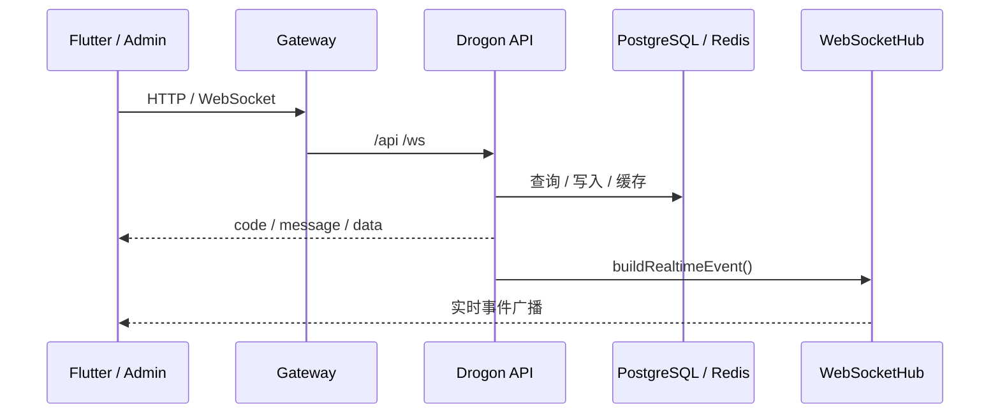

# API 与实时链路手册

当前系统只有一套统一入口：

- API：`http://121.41.195.165/api`
- 管理 API：`http://121.41.195.165/api/admin`
- WebSocket：`ws://121.41.195.165/ws/broadcast`

## 1. 链路总览

## 2. 认证

- 用户端：Bearer PASETO
- 管理端：管理员专用 Bearer PASETO
- WebSocket：连接时通过 query `token` 鉴权

## 3. HTTP 响应约定

### 业务壳

- `code`
- `message`
- `data`

成功时 `code = 0`。失败必须返回明确错误码和错误信息。

### 集合壳

- `items`
- `total`
- `page`
- `page_size`

页面和管理端都直接消费这套集合壳，不自行推导总数。

### 错误语义

- 契约错误：直接报错
- 权限错误：直接返回鉴权失败
- AI / 推荐降级：必须显式标注 `degraded` 或来源字段

## 4. WebSocket 约定

### 握手成功消息

- `type = auth_success`
- `user_id`
- `authenticated`
- `timestamp`

### 常用消息类型

- 客户端发：`join`、`leave`、`room_message`、`ping`
- 服务端发：`auth_success`、`pong`、`error`、业务广播事件

### 当前业务事件

- `new_stone`
- `stone_deleted`
- `ripple_update`
- `ripple_deleted`
- `boat_update`
- `boat_deleted`
- `new_notification`
- `new_friend_message`
- `friend_removed`
- `temp_friend_expired`
- `new_report`
- `new_moderation`
- `broadcast`
- `stats_update`

### 统一事件字段

- `type`
- `event`
- `timestamp`

常用 ID 字段会同时带 snake_case 和 camelCase。

## 5. 当前业务主链

- 内容链：投石、湖面流、石头详情、删除、共鸣搜索
- 互动链：涟漪、纸船、通知、连接消息
- 关系链：好友、临时好友、守护
- 情绪链：情绪日历、热力图、情绪趋势、脉搏
- AI 链：推荐、搜索、EdgeAI、湖神、安全港、咨询、VIP
- 管理链：Dashboard、审核、举报、配置、日志、广播

## 6. 相关手册

- 详细接口： [05_API接口全量清单.md](05_API接口全量清单.md)
- 架构总览： [04_技术实现全景手册.md](04_技术实现全景手册.md)
- 压测结果： [06_测试验证与压测手册.md](06_测试验证与压测手册.md)
