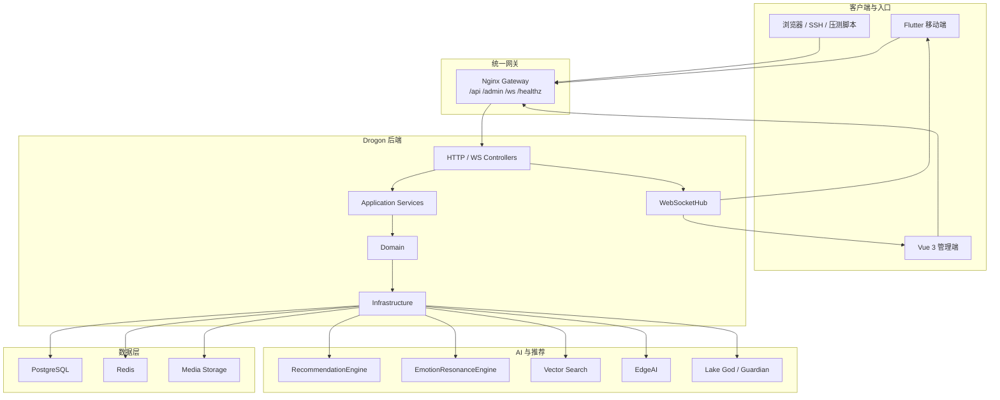
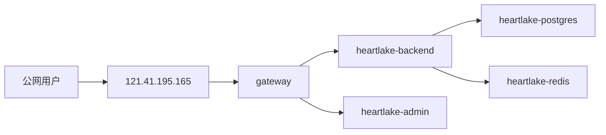

# 技术实现全景手册

本文描述 HeartLake 当前正在运行的技术实现。

## 1. 总架构

## 2. 部署拓扑

## 3. 后端分层职责

- `interfaces/`：HTTP 控制器、WebSocket 控制器、响应封装
- `application/`：业务编排、事务边界、跨模块写链
- `domain/`：实体、仓储接口、领域规则
- `infrastructure/`：数据库、缓存、媒体、AI、实时、过滤器
- `utils/`：PASETO、实时事件、ID、时间、响应工具

## 4. 三端职责

### Flutter 移动端

- 匿名登录与恢复
- 石头、涟漪、纸船互动
- 好友、临时好友、守护
- 情绪日历、热力图、脉搏
- 推荐、湖神、关怀、咨询、VIP

### Vue 管理端

- Dashboard
- 用户治理
- 内容治理
- 审核与举报
- 敏感词、日志、配置
- EdgeAI 管理与实时广播

### 后端

- API 和 WebSocket 统一入口
- 关系链、互动链、内容链
- 推荐链、向量链、AI 链
- 账号、隐私、导出、删除
- 管理端统计和实时事件

## 5. 当前关键链路

- 内容链：投石 -> 入库 -> 广播 -> 列表刷新
- 互动链：涟漪 / 纸船 -> 入库 -> 统计回写 -> 通知 / 广播
- 关系链：自动关系计算 -> 好友 / 临时好友列表 -> 私信
- AI 链：情绪分析 -> 推荐 / 共鸣 / 湖神 -> 显式结果或显式降级
- 管理链：后台查询 -> 统计聚合 -> 实时推送 -> 页面 stale/warning 状态

## 6. 当前工程约束

- 失败不伪装成空数据。
- 集合接口统一输出标准壳。
- 实时事件统一输出标准事件壳。
- 写链成功后才修改本地状态。
- AI / 推荐失败必须可见。
