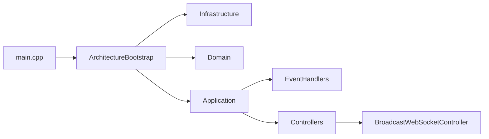

# 后端代码地图与启动链手册

本文按当前 `backend/` 代码结构描述 HeartLake 后端的入口、分层、启动顺序和主要模块，方便直接按文件定位实现。

## 1. 入口与启动主线

### 启动入口

- 主入口文件：`backend/src/main.cpp`
- 架构总装配：`backend/include/infrastructure/ArchitectureBootstrap.h`
- 应用服务工厂：`backend/src/application/ApplicationServiceFactory.cpp`

### 启动顺序

`main.cpp` 当前启动链是：

1. 加载 `.env` 和配置文件路径
2. 校验 `PASETO_KEY`、`DB_PASSWORD` 等关键环境变量
3. 计算线程数并应用低配机默认参数
4. 配置监听地址、日志、静态目录和上传目录
5. 注册异常处理、CORS、安全响应头、认证、链路追踪
6. 调 `ArchitectureBootstrap::initialize()`
7. 初始化 RBAC、内容过滤、AI、Embedding、EdgeAI、共鸣、推荐、RAG、限流、Redis、FriendshipTTL、ResonanceSearch
8. 按环境变量启动 LakeGod、EmotionTracking、UserFollowUp、WebSocket 心跳
9. `app.run()`

## 2. 分层结构



### `interfaces/`

职责：控制器、WebSocket 控制器、请求入口。

当前控制器文件：

- `AccountController.h`
- `AdminController.h`
- `AdminManagementController.h`
- `BroadcastWebSocketController.h`
- `ConsultationController.h`
- `EdgeAIController.h`
- `FriendController.h`
- `GuardianController.h`
- `HealthController.h`
- `InteractionController.h`
- `MediaController.h`
- `PaperBoatController.h`
- `PrivacyController.h`
- `RecommendationController.h`
- `ReportController.h`
- `SafeHarborController.h`
- `StoneController.h`
- `TempFriendController.h`
- `UserController.h`
- `VIPController.h`
- `VectorSearchController.h`

### `application/`

职责：业务编排、跨仓储写链、事件发送。

当前应用服务：

- `StoneApplicationService.cpp`
- `UserApplicationService.cpp`
- `InteractionApplicationService.cpp`
- `ApplicationServiceFactory.cpp`

### `domain/`

职责：领域规则、仓储接口、领域服务。

当前领域文件：

- `domain/stone/repositories/IStoneRepository.h`
- `domain/stone/repositories/StoneRepository.h`
- `domain/stone/services/StoneService.h`
- `domain/user/repositories/IUserRepository.h`
- `domain/user/repositories/UserRepository.h`
- `domain/friend/repositories/IFriendRepository.h`
- `domain/friend/repositories/FriendRepository.h`
- `domain/friend/services/FriendService.h`

### `infrastructure/`

职责：AI、缓存、过滤器、隐私、向量、后台任务、第三方能力。

当前子模块：

- `ai/`：`AIService`、`RecommendationEngine`、`DualMemoryRAG`、`EmotionResonanceEngine`、`EdgeAIEngine`、`OnnxSentimentEngine`、`HNSWIndex`
- `cache/`：`CacheManager`、`RedisCache`
- `filters/`：`AdminAuthFilter`、`RateLimitFilter`、`SecurityAuditFilter`、`TraceMiddleware`
- `privacy/`：`DifferentialPrivacyEngine`
- `services/`：`LakeGodGuardianService`、`EmotionTrackingService`、`UserFollowUpService`、`ResonanceSearchService`、`SafeHarborService`、`VIPService`
- `vector/`：`MilvusClient`

### `utils/`

职责：认证、权限、响应、事件、配置。

当前重点文件：

- `PasetoUtil.*`
- `RBACManager.*`
- `ResponseUtil.*`
- `RealtimeEvent.*`
- `AdminConfigStore.*`
- `EnvUtils.*`

## 3. 请求处理链

### HTTP

请求当前经过的关键阶段：

1. Gateway 转发到 Drogon
2. `registerPreRoutingAdvice` 处理 CORS 预检
3. `registerPreHandlingAdvice` 做 Bearer PASETO 鉴权
4. Controller 校验参数并分发到应用层或基础设施层
5. `registerPostHandlingAdvice` 注入 CORS、安全响应头、链路追踪
6. 返回统一 `code / message / data`

### WebSocket

核心文件：`backend/src/interfaces/api/BroadcastWebSocketController.cpp`

当前职责：

- 握手阶段通过 query `token` 鉴权
- 发送最小 `auth_success` 载荷
- 维护房间 `join / leave / room_message`
- 限制单条消息大小
- 心跳保活和超时回收
- 广播统一走 `buildRealtimeEvent()`

## 4. 当前控制器分组

### 用户与账号

- `UserController`
- `AccountController`
- `PrivacyController`
- `MediaController`
- `HealthController`

### 内容与互动

- `StoneController`
- `InteractionController`
- `PaperBoatController`
- `ReportController`

### 关系与守护

- `FriendController`
- `TempFriendController`
- `GuardianController`
- `VIPController`
- `SafeHarborController`
- `ConsultationController`

### 推荐与 AI

- `RecommendationController`
- `VectorSearchController`
- `EdgeAIController`

### 管理与实时

- `AdminController`
- `AdminManagementController`
- `BroadcastWebSocketController`

## 5. 应用层与 DI 装配

当前 DI 入口在 `ArchitectureBootstrap::initialize()`。

### 基础设施层注册

- `CacheManager`
- `EventBus`
- `MilvusClient`
- `SummaryService`

### 领域层注册

- `IStoneRepository -> StoneRepository`
- `IUserRepository -> UserRepository`
- `IFriendRepository -> FriendRepository`
- `StoneService`
- `FriendService`

### 应用层注册

`ApplicationServiceFactory.cpp` 当前注册：

- `StoneApplicationService`
- `UserApplicationService`
- `InteractionApplicationService`

### 事件订阅

- `StonePublishedEvent -> StonePublishedHandler`
- `BoatSentEvent -> BoatSentHandler`

## 6. AI 与后台任务链

当前 `main.cpp` 中显式初始化或启动的长链模块：

- `AIService`
- `AdvancedEmbeddingEngine`
- `EdgeAIEngine`
- `EmotionResonanceEngine`
- `RecommendationEngine`
- `DualMemoryRAG`
- `RateLimiter`
- `RedisCache`
- `FriendshipTTLEngine`
- `ResonanceSearchService`
- `LakeGodGuardianService`
- `EmotionTrackingService`
- `UserFollowUpService`

这些服务的开关和行为主要受环境变量控制，特别是：

- `ENABLE_LAKE_GOD_GUARDIAN`
- `ENABLE_EMOTION_TRACKING`
- `ENABLE_USER_FOLLOWUP`
- `ENABLE_WS_HEARTBEAT`
- `EDGE_AI_ONNX_ENABLED`
- `AI_PROVIDER`
- `AI_BASE_URL`

## 7. 当前环境变量分组

### 服务与监听

- `SERVER_HOST`
- `SERVER_PORT`
- `SERVER_THREADS`
- `LOG_LEVEL`
- `HEARTLAKE_CONFIG_PATH`

### 数据库与缓存

- `DB_HOST`
- `DB_PORT`
- `DB_NAME`
- `DB_USER`
- `DB_PASSWORD`
- `DB_POOL_SIZE`
- `REDIS_HOST`
- `REDIS_PORT`
- `REDIS_PASSWORD`
- `REDIS_POOL_SIZE`
- `REDIS_MAX_POOL_SIZE`

### 安全与公开地址

- `PASETO_KEY`
- `ADMIN_PASETO_KEY`
- `CORS_ALLOWED_ORIGIN`
- `PUBLIC_API_URL`
- `PUBLIC_WS_URL`

### AI 与低配参数

- `AI_PROVIDER`
- `AI_BASE_URL`
- `AI_MODEL`
- `AI_TIMEOUT`
- `EMBEDDING_DIM`
- `EMBEDDING_CACHE_SIZE`
- `EDGE_AI_ONNX_THREADS`
- `EDGE_AI_MODEL_PATH`
- `EDGE_AI_VOCAB_PATH`

## 8. 测试与构建入口

### 构建目录

- `backend/build-2c2g`
- `backend/build-hotpath-check`
- `backend/build-onnx-2c2g`

### 测试目录

- `backend/tests/controllers`
- `backend/tests/filters`
- `backend/tests/services`
- `backend/tests/utils`
- `backend/tests/websocket`

### 常用命令

```bash
cd backend
cmake -S . -B build-2c2g -DCMAKE_BUILD_TYPE=Release
cmake --build build-2c2g -j2
```
