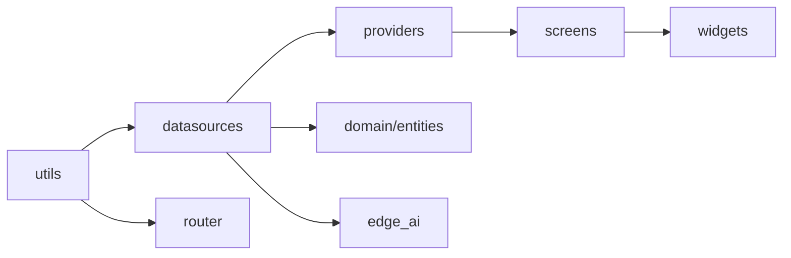

# 移动端代码地图与状态链手册

本文按当前 `frontend/lib/` 代码结构描述移动端启动链、依赖注入、数据流和页面组织。

## 1. 入口与启动主线

### 主入口

- 应用入口：`frontend/lib/main.dart`
- 路由入口：`frontend/lib/router/app_router.dart`
- 配置入口：`frontend/lib/utils/app_config.dart`
- 依赖注入：`frontend/lib/di/service_locator.dart`

### 启动顺序

`main.dart` 当前做的事情：

1. `runZonedGuarded` 包裹全局异常
2. 注册 `FlutterError.onError` 和 `platformDispatcher.onError`
3. 设置 `ErrorWidget.builder`
4. `setupServiceLocator()`
5. `appConfig.initialize()`
6. `CacheService().startAutoCleanup()`
7. 配置 `ApiClient` 的 token 刷新回调和 401 跳转
8. 以 `MultiProvider` 挂载全局状态

## 2. 目录结构

### `data/datasources/`

职责：协议归一、请求发送、WebSocket 和本地缓存协作。

当前主要文件：

- 认证与账号：`auth_service.dart`、`account_service.dart`、`user_service.dart`
- 内容互动：`stone_service.dart`、`interaction_service.dart`、`notification_service.dart`
- 关系链：`friend_service.dart`、`temp_friend_service.dart`、`guardian_service.dart`
- AI 与推荐：`ai_recommendation_service.dart`、`recommendation_service.dart`、`edge_ai_service.dart`、`lake_god_service.dart`
- 关怀与增值：`consultation_service.dart`、`psych_support_service.dart`、`vip_service.dart`
- 基础件：`api_client.dart`、`websocket_manager.dart`、`cache_service.dart`

### `presentation/providers/`

当前全局 Provider：

- `theme_provider.dart`
- `user_provider.dart`
- `notification_provider.dart`
- `stone_provider.dart`
- `friend_provider.dart`
- `edge_ai_provider.dart`

### `presentation/screens/`

当前页面文件覆盖：

- 启动与认证：`splash_screen.dart`、`onboarding_screen.dart`、`auth_screen.dart`
- 主流程：`home_screen.dart`、`lake_screen.dart`、`lake_feed_screen.dart`、`publish_screen.dart`
- 内容详情与个人中心：`stone_detail_screen.dart`、`profile_screen.dart`
- 我的内容：`my_stones_screen.dart`、`my_boats_screen.dart`、`my_ripples_screen.dart`、`received_boats_screen.dart`
- 情绪链：`emotion_calendar_screen.dart`、`emotion_heatmap_screen.dart`、`emotion_trends_screen.dart`
- 关系链：`friends_screen.dart`、`friend_chat_screen.dart`、`temp_friends_screen.dart`、`guardian_screen.dart`
- AI 与发现：`discover_screen.dart`、`personalized_screen.dart`、`lake_god_chat_screen.dart`
- 关怀与咨询：`safe_harbor_screen.dart`、`consultation_screen.dart`、`vip_screen.dart`
- 其他：`notification_screen.dart`、`privacy_settings_screen.dart`、`user_detail_screen.dart`、`help_screen.dart`

### `presentation/widgets/`

职责：通用组件、石头卡片、动画、图表和局部业务 UI。

重点目录：

- `widgets/stone_card/`
- `widgets/animations/`

### `domain/entities/`

当前实体：

- `stone.dart`
- `user.dart`
- `recommended_stone.dart`
- `emotion_trend_point.dart`
- `emotion_type.dart`
- `api_response.dart`

### `utils/`

当前基础件：

- `app_config.dart`
- `app_theme.dart`
- `app_logger.dart`
- `storage_util.dart`
- `payload_contract.dart`
- `error_codes.dart`
- `error_handler.dart`
- `circuit_breaker.dart`
- `e2e_encryption.dart`

## 3. 路由与页面访问

核心路由定义在 `app_router.dart`。

### 永久公开路由

- `/`
- `/onboarding`
- `/auth`

### 登录后路由

- `/home`
- `/notifications`
- `/stone-detail`
- `/profile`
- `/my-stones`
- `/my-boats`
- `/my-ripples`
- `/received-boats`
- `/emotion-heatmap`
- `/emotion-calendar`
- `/emotion-trends`
- `/guardian`
- `/safe-harbor`
- `/consultation`
- `/light`
- `/help`
- `/privacy-settings`
- `/lake-god-chat`
- `/personalized`
- `/friends`
- `/friend-chat`
- `/temp-friends`
- `/user-detail`
- `/discover`
- `/lake-feed`

路由守卫当前通过 `StorageUtil.getToken()` 和 `StorageUtil.getUserId()` 判断是否放行。

## 4. 依赖注入与单例服务

`service_locator.dart` 当前注册的懒单例：

- `AuthService`
- `UserService`
- `AccountService`
- `StoneService`
- `InteractionService`
- `FriendService`
- `TempFriendService`
- `NotificationService`
- `GuardianService`
- `ReportService`
- `EdgeAIService`
- `AIRecommendationService`
- `RecommendationService`
- `LakeGodService`
- `ConsultationService`
- `PsychSupportService`
- `VIPService`

## 5. 网络层与状态流

### HTTP

`api_client.dart` 当前职责：

- 基于 Dio 统一 base URL 和超时
- 请求自动注入 Bearer token 和 `X-User-Id`
- 401 时触发 refresh token 流
- GET 请求通过 `CacheService` 做缓存配合
- 支持证书 Pinning 开关

### WebSocket

`websocket_manager.dart` 当前职责：

- 通过 query `token` 握手鉴权
- 维护离线消息队列
- 房间引用计数管理
- 自动重连和错误上报
- 统一实时事件监听与分发

### Payload 归一

`payload_contract.dart` 当前负责：

- snake_case / camelCase 双向镜像
- 提取 `stone_id`、`boat_id`、`ripple_id`、`notification_id`
- 统一解析实时事件与嵌套 payload

### 本地存储

`storage_util.dart` 当前分层：

- 敏感数据：`FlutterSecureStorage`
- 普通数据：`SharedPreferences`
- Web 端读取失败时做一次修复并显式抛错

## 6. 当前状态链

### 内容链

`StoneProvider` 负责：

- 湖面列表
- 我的石头
- 实时石头事件
- 计数与局部刷新

### 账号链

`UserProvider` 负责：

- 恢复登录态
- 资料读写
- 登出和账号基础信息

### 关系链

`FriendProvider` 负责：

- 好友列表
- 临时好友列表入口协同
- 关系变更后的页面状态同步

### 通知链

`NotificationProvider` 负责：

- 通知列表
- 未读数
- 已读状态回写

### AI 链

`EdgeAIProvider` 负责：

- 情绪分析状态
- 结果、警告、失败可见化

## 7. 当前页面到数据流

移动端当前推荐的阅读顺序：

1. `main.dart`
2. `app_router.dart`
3. `service_locator.dart`
4. `api_client.dart`
5. `websocket_manager.dart`
6. `presentation/providers/*.dart`
7. `presentation/screens/*.dart`

典型链路是：

`Screen -> Provider -> Service -> ApiClient/WebSocketManager -> Storage/Cache -> UI`

## 8. 当前运行参数

### Dart Define

- `PUBLIC_ORIGIN`
- `API_BASE_URL`
- `WS_URL`
- `PRODUCTION_PUBLIC_ORIGIN`
- `ENABLE_CERT_PINNING`
- `CERT_SHA256_PINS`

### 当前 release 输出

- 路径：`frontend/build/app/outputs/flutter-apk/app-release.apk`
- 当前 SHA-256：`9654d5facf294ab1c0d21e6ce6f73728d346977994fe911a23be1de02553ac31`
