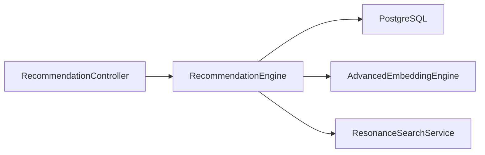
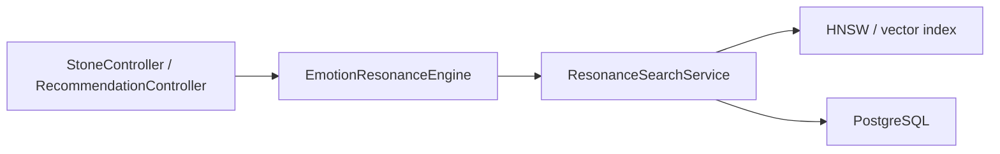
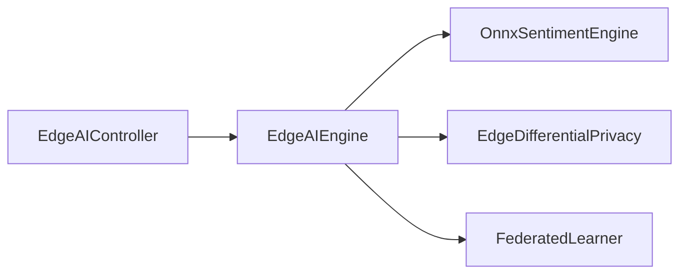

# AI、推荐与后台任务手册

本文描述当前 AI、推荐、情绪分析、共鸣和后台守护任务的代码入口与运行关系。

## 1. 模块总览

当前相关实现主要在：

- `backend/src/infrastructure/ai/`
- `backend/src/infrastructure/services/`
- `backend/src/interfaces/api/RecommendationController.cpp`
- `backend/src/interfaces/api/VectorSearchController.cpp`
- `backend/src/interfaces/api/EdgeAIController.cpp`
- `backend/src/interfaces/api/GuardianController.cpp`

## 2. 当前 AI 子模块

### 基础 AI 服务

- `AIService.cpp`
- `SummaryService.cpp`
- `SentimentAnalyzer.cpp`
- `SemanticCache.cpp`

职责：

- 统一上游 AI 调用
- 文本摘要
- 情绪分析路由
- 语义缓存

### 向量与推荐

- `AdvancedEmbeddingEngine.cpp`
- `RecommendationEngine.cpp`
- `HNSWIndex.cpp`
- `EmotionResonanceEngine.cpp`
- `DualMemoryRAG.cpp`
- `OnnxSentimentEngine.cpp`
- `ModelQuantizer.cpp`

职责：

- 生成嵌入
- 热门 / 个性化 / 高级推荐
- 共鸣搜索
- 向量检索
- 湖神上下文拼接
- ONNX 小模型推理

### Edge AI 与隐私

- `EdgeAIEngine.cpp`
- `EdgeDifferentialPrivacy.cpp`
- `EdgeNodeMonitor.cpp`
- `EmotionPulseDetector.cpp`
- `FederatedLearner.cpp`

职责：

- 边缘推理入口
- 差分隐私预算
- 边缘节点状态
- 情绪脉搏检测
- 联邦学习轮次

## 3. 控制器入口

### 推荐链

- `RecommendationController`
- `VectorSearchController`

当前承担：

- 混合推荐
- 情绪发现
- 热门内容
- 高级推荐
- 语义搜索
- 相似石头
- 个性化推荐

### AI 与情绪链

- `EdgeAIController`
- `GuardianController`
- `VIPController`
- `SafeHarborController`
- `ConsultationController`
- `UserController` 的情绪日历和热力图接口

## 4. 当前运行时初始化顺序

`main.cpp` 当前顺序是：

1. `AIService::initialize(aiConfig)`
2. `AdvancedEmbeddingEngine::initialize(...)`
3. `EdgeAIEngine::initialize(edgeAIConfig)`
4. 预热 `EmotionResonanceEngine`
5. `RecommendationEngine::initialize(32)`
6. 预热 `DualMemoryRAG`
7. `ResonanceSearchService::initialize(...)`

## 5. 当前后台任务

### LakeGodGuardianService

代码：`LakeGodGuardianService.cpp`

职责：

- 湖神守护扫描
- 零互动内容巡检
- 自动关怀触发

关键开关：

- `ENABLE_LAKE_GOD_GUARDIAN`
- `LAKE_GOD_STARTUP_DELAY_SEC`
- `LAKE_GOD_SCAN_INTERVAL_MINUTES`
- `LAKE_GOD_ZERO_INTERACTION_THRESHOLD_HOURS`
- `LAKE_GOD_SCAN_BATCH_SIZE`

### EmotionTrackingService

代码：`EmotionTrackingService.cpp`

职责：

- 情绪追踪采样
- 情绪历史写入
- 趋势链路支撑

关键开关：

- `ENABLE_EMOTION_TRACKING`
- `EMOTION_TRACKING_STARTUP_DELAY_SEC`
- `EMOTION_TRACKING_SCAN_INTERVAL_MINUTES`

### UserFollowUpService

代码：`UserFollowUpService.cpp`

职责：

- 用户回访与跟进
- 低活跃或风险用户触发

关键开关：

- `ENABLE_USER_FOLLOWUP`
- `USER_FOLLOWUP_STARTUP_DELAY_SEC`
- `USER_FOLLOWUP_SCAN_INTERVAL_HOURS`

### FriendshipTTLEngine

代码：`FriendshipTTLEngine.cpp`

职责：

- 临时好友过期
- 关系 TTL 清理

## 6. 当前数据支撑表

AI 和后台任务当前会用到这些表：

- `stone_embeddings`
- `user_emotion_history`
- `user_interaction_history`
- `emotion_tracking`
- `resonance_points`
- `lake_god_messages`
- `edge_ai_inference_logs`
- `federated_learning_rounds`
- `differential_privacy_budget`
- `community_emotion_snapshots`
- `edge_nodes`
- `vector_index_metadata`
- `user_followups`
- `high_risk_events`
- `admin_interventions`

## 7. 当前请求链路

### 推荐链

### 共鸣链

### EdgeAI 链

## 8. 当前工程约束

- AI 失败必须显式暴露
- 推荐失败不能回落成假空列表
- 共鸣失败不能冒充“无匹配”
- 降级路径必须可识别
- 后台任务必须由环境变量显式控制

## 9. 当前重点观察项

- 推荐和共鸣链长尾
- `stone_embeddings`、`emotion_tracking` 顺序扫描
- 语义缓存命中率
- EdgeAI 小模型线程数
- 低配机后台任务开启后的 CPU 占用
