# HeartLake 技术架构文档

> **版本**: v2.0 | **最后更新**: 2026-02-25 | **作者**: HeartLake 团队
>
> 本文档基于源码逐行审计，所有技术参数均从代码中提取验证。

---

## 目录

1. [系统架构总览](#1-系统架构总览)
2. [后端架构：DDD 四层模型](#2-后端架构ddd-四层模型)
3. [EdgeAI 八大子系统架构](#3-edgeai-八大子系统架构)
4. [隐私保护洋葱模型](#4-隐私保护洋葱模型)
5. [安全架构](#5-安全架构)
6. [数据流图](#6-数据流图)
7. [部署架构](#7-部署架构)
8. [性能设计](#8-性能设计)

---

## 1. 系统架构总览

HeartLake（心湖）是一个面向情感社交的全栈平台，采用 **C++20 高性能后端 + Flutter 跨平台移动端 + Vue 3 管理后台** 的三端架构，内置自研 EdgeAI 引擎实现端侧智能。

### 1.1 技术栈全景

| 层级 | 技术选型 | 版本 |
|------|----------|------|
| 移动端 | Flutter / Dart | 3.x |
| 管理后台 | Vue 3 + Vite + Element Plus | Vue 3.4+ |
| 后端框架 | Drogon (C++20) | 1.9+ |
| 数据库 | PostgreSQL | 16-alpine |
| 缓存 | Redis | 7-alpine |
| AI 推理 | Ollama (heartlake-qwen) + ONNX Runtime | 0.6.2 |
| 反向代理 | Nginx | 1.27-alpine |
| 容器编排 | Docker Compose | v2 |

### 1.2 系统架构总览图

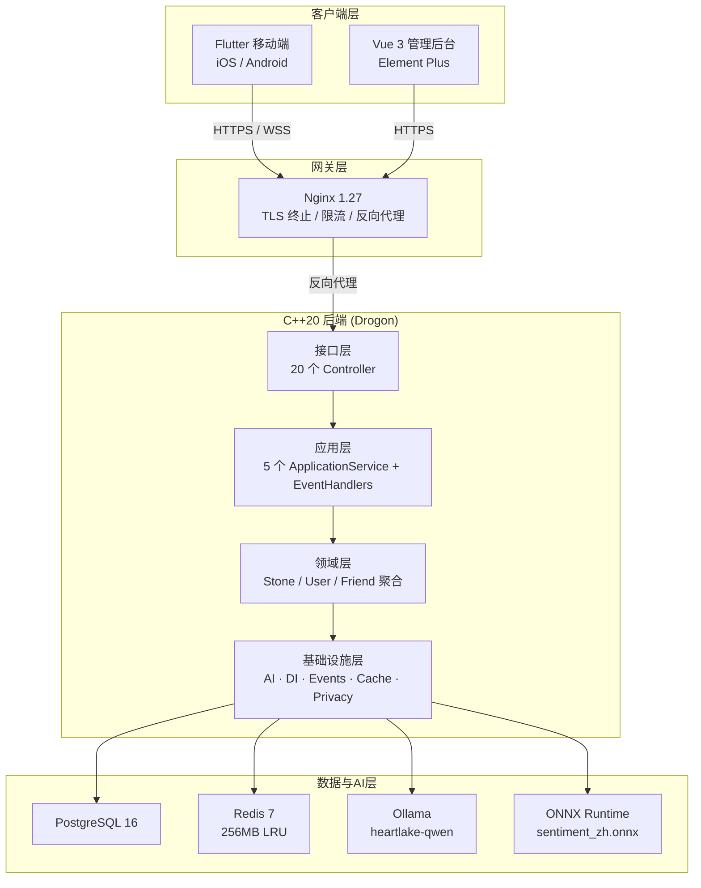
```mermaid
graph TB
    subgraph 客户端["客户端层"]
        Flutter["Flutter 移动端<br/>iOS / Android"]
        Admin["Vue 3 管理后台<br/>Element Plus"]
    end

    subgraph 网关层["网关层"]
        Nginx["Nginx 1.27<br/>TLS 终止 / 限流 / 反向代理"]
    end

    subgraph 后端["C++20 后端 (Drogon)"]
        direction TB
        Interfaces["接口层<br/>20 个 Controller"]
        Application["应用层<br/>5 个 ApplicationService + EventHandlers"]
        Domain["领域层<br/>Stone / User / Friend 聚合"]
        Infrastructure["基础设施层<br/>AI · DI · Events · Cache · Privacy"]
    end

    subgraph 数据层["数据与AI层"]
        PG["PostgreSQL 16"]
        Redis["Redis 7<br/>256MB LRU"]
        Ollama["Ollama<br/>heartlake-qwen"]
        ONNX["ONNX Runtime<br/>sentiment_zh.onnx"]
    end

    Flutter -->|HTTPS / WSS| Nginx
    Admin -->|HTTPS| Nginx
    Nginx -->|反向代理| Interfaces
    Interfaces --> Application
    Application --> Domain
    Domain --> Infrastructure
    Infrastructure --> PG
    Infrastructure --> Redis
    Infrastructure --> Ollama
    Infrastructure --> ONNX
```

### 1.3 核心设计原则

- **DDD 驱动**: 领域模型为核心，业务逻辑不泄漏到基础设施层
- **事件驱动**: EventBus 解耦领域事件，异步处理 AI 分析任务
- **隐私优先**: 差分隐私 + 端到端加密 + 身份影子映射，三重保护
- **边缘智能**: 8 大 AI 子系统本地运行，零数据外传

---

## 2. 后端架构：DDD 四层模型

HeartLake 后端严格遵循 DDD（领域驱动设计）四层架构，各层职责清晰，依赖方向单一（外层依赖内层，内层不依赖外层）。

### 2.1 四层架构图

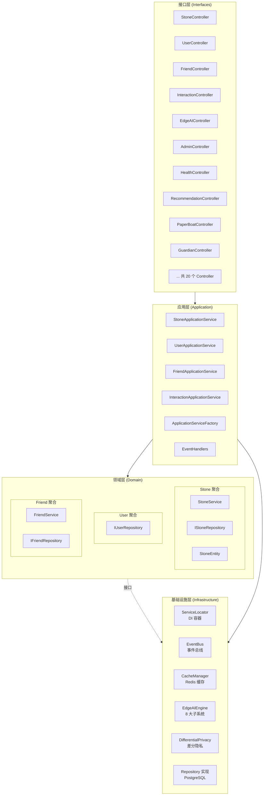
```mermaid
graph TB
    subgraph Interfaces["接口层 (Interfaces)"]
        direction LR
        SC["StoneController"]
        UC["UserController"]
        FC["FriendController"]
        IC["InteractionController"]
        EC["EdgeAIController"]
        AC["AdminController"]
        HC["HealthController"]
        RC["RecommendationController"]
        PC["PaperBoatController"]
        GC["GuardianController"]
        More["... 共 20 个 Controller"]
    end

    subgraph Application["应用层 (Application)"]
        direction LR
        SAS["StoneApplicationService"]
        UAS["UserApplicationService"]
        FAS["FriendApplicationService"]
        IAS["InteractionApplicationService"]
        ASF["ApplicationServiceFactory"]
        EH["EventHandlers"]
    end

    subgraph DomainLayer["领域层 (Domain)"]
        direction TB
        subgraph StoneAgg["Stone 聚合"]
            SS["StoneService"]
            ISR["IStoneRepository"]
            SE["StoneEntity"]
        end
        subgraph UserAgg["User 聚合"]
            IUR["IUserRepository"]
        end
        subgraph FriendAgg["Friend 聚合"]
            FS["FriendService"]
            IFR["IFriendRepository"]
        end
    end

    subgraph Infra["基础设施层 (Infrastructure)"]
        direction LR
        DI["ServiceLocator<br/>DI 容器"]
        EB["EventBus<br/>事件总线"]
        CM["CacheManager<br/>Redis 缓存"]
        AI["EdgeAIEngine<br/>8 大子系统"]
        DP["DifferentialPrivacy<br/>差分隐私"]
        Repo["Repository 实现<br/>PostgreSQL"]
    end

    Interfaces --> Application
    Application --> DomainLayer
    DomainLayer -.->|接口| Infra
    Application --> Infra
```

### 2.2 各层详解

#### 接口层 (20 个 Controller)

负责 HTTP/WebSocket 请求的接收、参数校验、响应序列化。不包含任何业务逻辑。

| Controller | 职责 |
|-----------|------|
| StoneController | 石头（帖子）CRUD |
| UserController | 用户信息管理 |
| AccountController | 注册 / 登录 / Token 刷新 |
| FriendController | 好友关系管理 |
| InteractionController | 涟漪（点赞）/ 评论 |
| PaperBoatController | 纸船（私信）收发 |
| EdgeAIController | AI 能力 HTTP 端点 |
| RecommendationController | 推荐接口 |
| AdminController | 管理后台接口 |
| BroadcastWebSocketController | WebSocket 实时推送 |
| GuardianController | 心理守护接口 |
| SafeHarborController | 安全港湾接口 |
| PrivacyController | 隐私设置接口 |
| VectorSearchController | 向量搜索接口 |
| ConsultationController | 咨询接口 |
| ReportController | 举报接口 |
| VIPController | VIP 功能接口 |
| AdminManagementController | 管理员管理 |
| TempFriendController | 临时好友接口 |
| HealthController | 健康检查 |

#### 应用层 (ApplicationService)

编排用例流程，协调领域服务、仓储、缓存和事件。以 `StoneApplicationService` 为例：

```cpp
class StoneApplicationService {
private:
    std::shared_ptr<domain::stone::StoneService> stoneService_;      // 领域服务
    std::shared_ptr<domain::stone::IStoneRepository> stoneRepository_; // 仓储接口
    std::shared_ptr<core::cache::CacheManager> cacheManager_;         // 缓存管理
    std::shared_ptr<core::events::EventBus> eventBus_;                // 事件总线

public:
    // 发布石头：校验 → 领域逻辑 → 持久化 → 发布事件 → 异步AI处理
    Json::Value publishStone(userId, content, stoneType, stoneColor, moodType, isAnonymous);
    // 异步处理：情感分析 + 内容审核 + 向量索引
    void processStoneAsync(stoneId, userId, content, moodType);
};
```

**ApplicationServiceFactory** 通过静态 `initialize()` 方法将所有应用服务注册到 DI 容器。

#### 领域层 (Domain Aggregates)

纯业务逻辑，不依赖任何基础设施。通过接口（`IStoneRepository`、`IFriendRepository`）实现依赖倒置。

```cpp
// 领域实体
struct StoneEntity {
    std::string stoneId, userId, content, stoneType, stoneColor, moodType, status, createdAt;
    bool isAnonymous;
    int ripplesCount, boatsCount, viewsCount;
};

// 仓储接口（领域层定义，基础设施层实现）
class IStoneRepository {
    virtual StoneEntity save(const StoneEntity& stone) = 0;
    virtual std::optional<StoneEntity> findById(const std::string& stoneId) = 0;
    // ...
};
```

#### 基础设施层

| 组件 | 实现 | 说明 |
|------|------|------|
| ServiceLocator | `std::type_index` + `recursive_mutex` | 类型擦除 DI 容器，支持单例/实例注册 |
| EventBus | 类型索引 + `std::any` 处理器 | 快照式发布避免死锁 |
| CacheManager | Redis 7 客户端封装 | 256MB allkeys-lru 策略 |
| EdgeAIEngine | 8 大子系统 | 详见第 3 章 |
| Repository 实现 | PostgreSQL 16 | 实现领域层仓储接口 |

### 2.3 依赖注入与服务定位

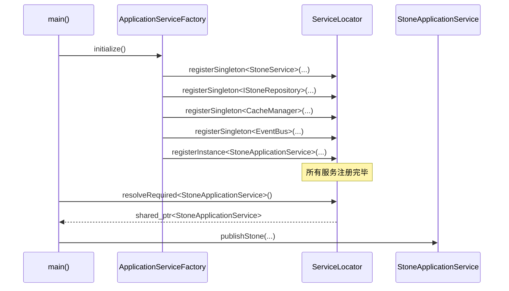
```mermaid
sequenceDiagram
    participant Main as main()
    participant ASF as ApplicationServiceFactory
    participant SL as ServiceLocator
    participant SAS as StoneApplicationService

    Main->>ASF: initialize()
    ASF->>SL: registerSingleton<StoneService>(...)
    ASF->>SL: registerSingleton<IStoneRepository>(...)
    ASF->>SL: registerSingleton<CacheManager>(...)
    ASF->>SL: registerSingleton<EventBus>(...)
    ASF->>SL: registerInstance<StoneApplicationService>(...)
    Note over SL: 所有服务注册完毕

    Main->>SL: resolveRequired<StoneApplicationService>()
    SL-->>Main: shared_ptr<StoneApplicationService>
    Main->>SAS: publishStone(...)
```

ServiceLocator 采用 `recursive_mutex` 保证线程安全，支持三种注册模式：

- `registerInstance<T>`: 注册已有实例
- `registerSingleton<T>`: 延迟创建单例
- `resolve<T>` / `resolveRequired<T>`: 解析服务（后者在未找到时抛异常）

### 2.4 领域事件流

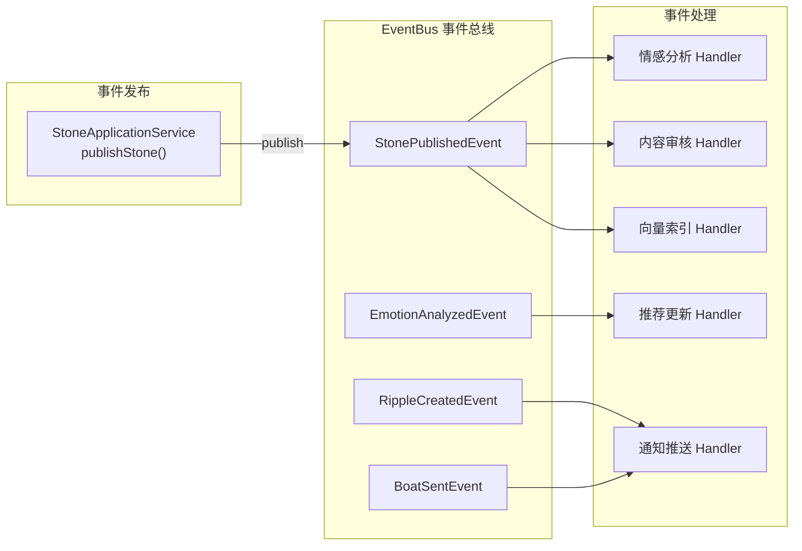
```mermaid
graph LR
    subgraph 事件发布
        SAS["StoneApplicationService<br/>publishStone()"]
    end

    subgraph EventBus["EventBus 事件总线"]
        SPE["StonePublishedEvent"]
        EAE["EmotionAnalyzedEvent"]
        RCE["RippleCreatedEvent"]
        BSE["BoatSentEvent"]
    end

    subgraph 事件处理
        EH1["情感分析 Handler"]
        EH2["内容审核 Handler"]
        EH3["向量索引 Handler"]
        EH4["推荐更新 Handler"]
        EH5["通知推送 Handler"]
    end

    SAS -->|publish| SPE
    SPE --> EH1
    SPE --> EH2
    SPE --> EH3
    EAE --> EH4
    RCE --> EH5
    BSE --> EH5
```

EventBus 使用快照式分发机制：发布事件时先复制 handler 列表，再逐一调用，避免在回调中注册/注销 handler 导致的死锁。

---

## 3. EdgeAI 八大子系统架构

EdgeAI 引擎是 HeartLake 的核心创新，8 个子系统全部在本地运行，实现零数据外传的端侧智能。

### 3.1 子系统全景图

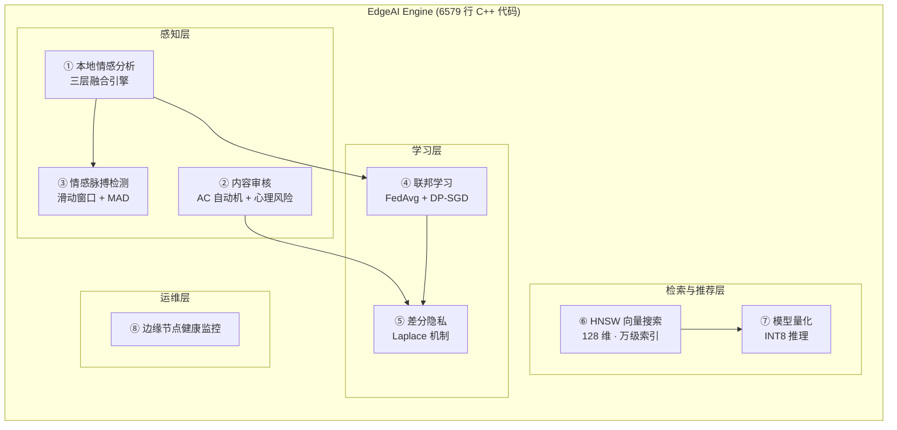
```mermaid
graph TB
    subgraph EdgeAI["EdgeAI Engine (6579 行 C++ 代码)"]
        direction TB
        subgraph 感知层["感知层"]
            S1["① 本地情感分析<br/>三层融合引擎"]
            S2["② 内容审核<br/>AC 自动机 + 心理风险"]
            S3["③ 情感脉搏检测<br/>滑动窗口 + MAD"]
        end

        subgraph 学习层["学习层"]
            S4["④ 联邦学习<br/>FedAvg + DP-SGD"]
            S5["⑤ 差分隐私<br/>Laplace 机制"]
        end

        subgraph 检索层["检索与推荐层"]
            S6["⑥ HNSW 向量搜索<br/>128 维 · 万级索引"]
            S7["⑦ 模型量化<br/>INT8 推理"]
        end

        subgraph 运维层["运维层"]
            S8["⑧ 边缘节点健康监控"]
        end
    end

    S1 --> S3
    S1 --> S4
    S2 --> S5
    S6 --> S7
    S4 --> S5
```

### 3.2 子系统详解

#### ① 本地情感分析 — 三层融合引擎

采用规则层 + 词典层 + 统计层的三层融合架构，无需网络即可完成情感分析。

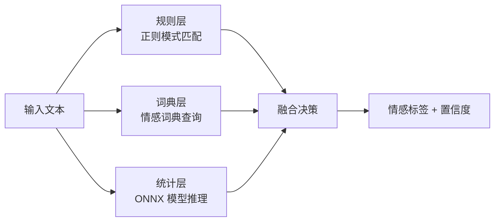
```mermaid
graph LR
    Input["输入文本"] --> R["规则层<br/>正则模式匹配"]
    Input --> L["词典层<br/>情感词典查询"]
    Input --> S["统计层<br/>ONNX 模型推理"]

    R --> Fusion["融合决策"]
    L --> Fusion
    S --> Fusion
    Fusion --> Output["情感标签 + 置信度"]
```

- **规则层**: 基于正则表达式的快速模式匹配，处理明确的情感表达
- **词典层**: 内置中文情感词典，支持程度副词、否定词、转折词的组合计算
- **统计层**: ONNX Runtime 加载 `sentiment_zh.onnx` 模型，INT8 量化推理
- **融合策略**: 三层结果加权融合，规则层优先级最高（处理极端情况）

#### ② 内容审核 — AC 自动机 + 五因子心理风险

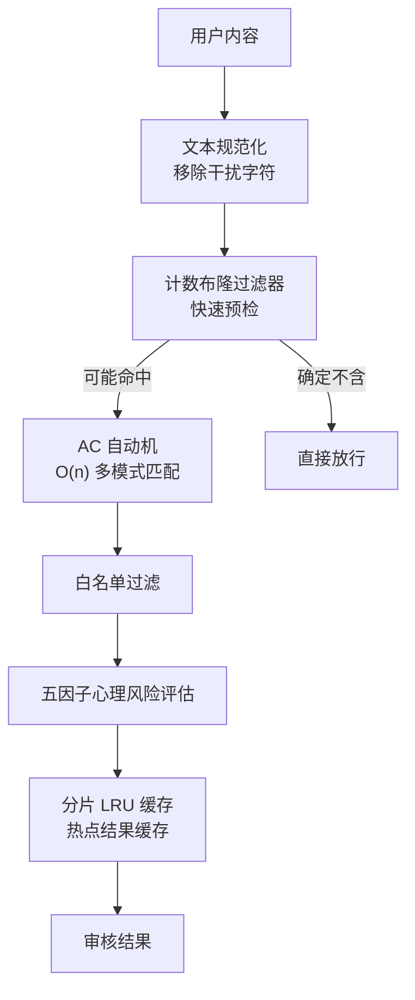
```mermaid
graph TB
    Input["用户内容"] --> Norm["文本规范化<br/>移除干扰字符"]
    Norm --> BF["计数布隆过滤器<br/>快速预检"]
    BF -->|可能命中| AC["AC 自动机<br/>O(n) 多模式匹配"]
    BF -->|确定不含| Pass["直接放行"]
    AC --> WL["白名单过滤"]
    WL --> Risk["五因子心理风险评估"]
    Risk --> Cache["分片 LRU 缓存<br/>热点结果缓存"]
    Cache --> Result["审核结果"]
```

**五因子心理风险模型**:

| 因子 | 说明 |
|------|------|
| selfHarmIntent | 自伤意图检测 |
| hopelessness | 绝望感评估 |
| socialIsolation | 社交孤立程度 |
| temporalUrgency | 时间紧迫性 |
| linguisticMarkers | 语言学标记 |

**ContentFilter 核心组件**:

- `ACAutomaton`: Aho-Corasick 自动机，O(n) 时间复杂度多模式匹配
- `CountingBloomFilter<>`: 计数布隆过滤器，支持删除操作的概率预检
- `ShardedLRUCache<string, string>`: 分片 LRU 缓存，减少锁竞争
- `reload()`: 支持热更新敏感词库，无需重启服务

#### ③ 情感脉搏检测

基于滑动窗口的情感趋势分析，使用 MAD（中位数绝对偏差）进行异常值剔除。

- 滑动窗口收集用户近期情感数据
- MAD 算法剔除异常波动点
- 检测情感突变（如突然从积极转为消极）
- 触发心理守护预警机制

#### ④ 联邦学习 — FedAvg + DP-SGD

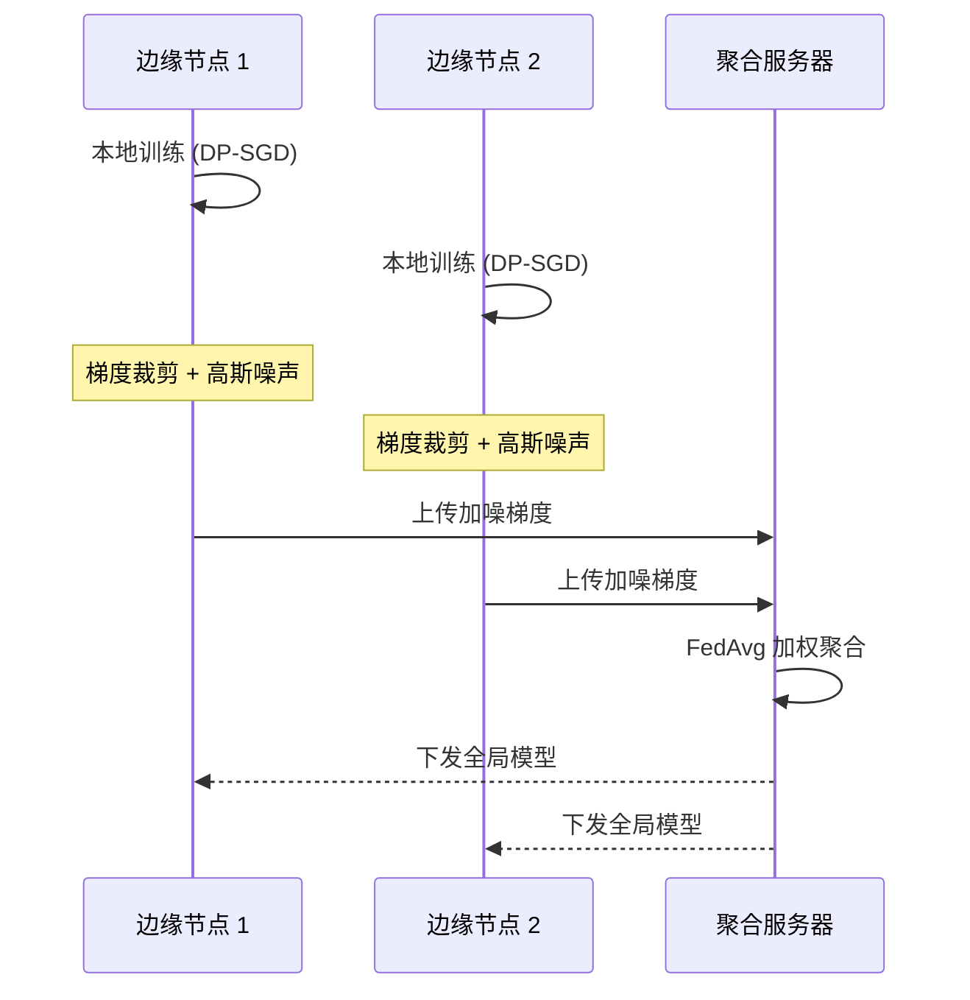
```mermaid
sequenceDiagram
    participant Node1 as 边缘节点 1
    participant Node2 as 边缘节点 2
    participant Server as 聚合服务器

    Node1->>Node1: 本地训练 (DP-SGD)
    Node2->>Node2: 本地训练 (DP-SGD)
    Note over Node1: 梯度裁剪 + 高斯噪声
    Note over Node2: 梯度裁剪 + 高斯噪声

    Node1->>Server: 上传加噪梯度
    Node2->>Server: 上传加噪梯度

    Server->>Server: FedAvg 加权聚合
    Server-->>Node1: 下发全局模型
    Server-->>Node2: 下发全局模型
```

- **FedAvg**: 按数据量加权聚合各节点模型参数
- **DP-SGD**: 梯度裁剪 + 高斯噪声注入，保证训练过程的差分隐私
- 原始数据永远不离开本地节点

#### ⑤ 差分隐私 — Laplace 机制

```cpp
// 核心参数（源自 DifferentialPrivacyEngine.h）
struct PrivateEmotionStats {
    std::array<double, 7> moodDistribution;  // 7 种情绪分布
    double epsilon;                           // 隐私预算
    double consumed;                          // 已消耗预算
};
```

- **Laplace 噪声**: 对情感统计数据添加 Laplace 分布噪声
- **隐私预算追踪**: 严格追踪 ε 消耗，预算耗尽时拒绝查询
- **7 种情绪类别**: 覆盖完整情感谱系
- 理论基础: FedMultiEmo 论文

#### ⑥ HNSW 向量搜索

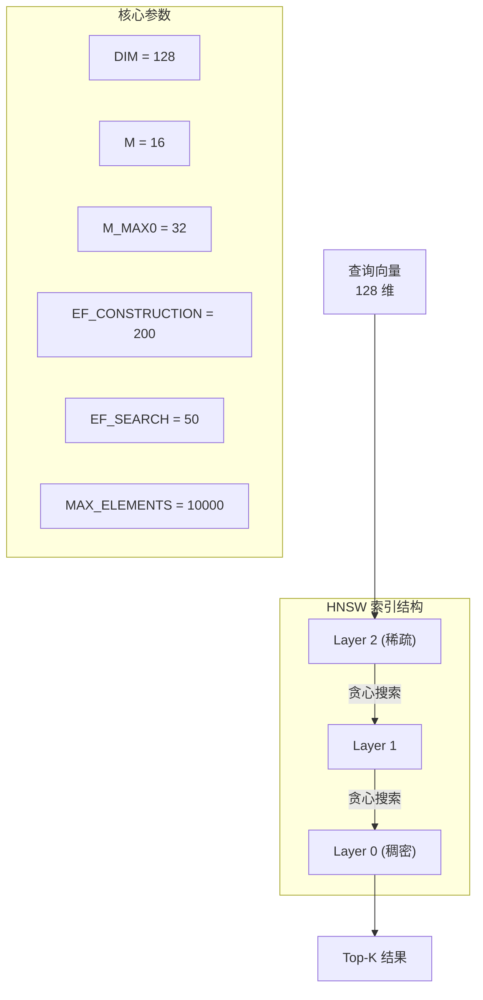
```mermaid
graph TB
    subgraph HNSW["HNSW 索引结构"]
        L2["Layer 2 (稀疏)"]
        L1["Layer 1"]
        L0["Layer 0 (稠密)"]
    end

    Query["查询向量<br/>128 维"] --> L2
    L2 -->|贪心搜索| L1
    L1 -->|贪心搜索| L0
    L0 --> TopK["Top-K 结果"]

    subgraph 参数["核心参数"]
        P1["DIM = 128"]
        P2["M = 16"]
        P3["M_MAX0 = 32"]
        P4["EF_CONSTRUCTION = 200"]
        P5["EF_SEARCH = 50"]
        P6["MAX_ELEMENTS = 10000"]
    end
```

| 参数 | 值 | 说明 |
|------|-----|------|
| DIM | 128 | 向量维度 |
| M | 16 | 每层最大连接数 |
| M_MAX0 | 32 | 第 0 层最大连接数 |
| EF_CONSTRUCTION | 200 | 构建时搜索宽度 |
| EF_SEARCH | 50 | 查询时搜索宽度 |
| MAX_ELEMENTS | 10,000 | 最大索引容量 |

- 支持 LRU 缓存热点查询结果
- `shared_mutex` 读写锁保证并发安全

#### ⑦ 模型量化 — INT8

- 将浮点模型量化为 INT8 精度
- ONNX Runtime 执行量化推理
- 推理速度提升约 2-4x，内存占用降低约 75%
- 配置: `EDGE_AI_ONNX_THREADS=2`

#### ⑧ 边缘节点健康监控

- 实时监控各 AI 子系统运行状态
- CPU / 内存 / 推理延迟指标采集
- 异常自动告警与降级策略

---

## 4. 隐私保护洋葱模型

HeartLake 采用四层洋葱式隐私保护架构，从内到外层层加固。

### 4.1 洋葱模型图

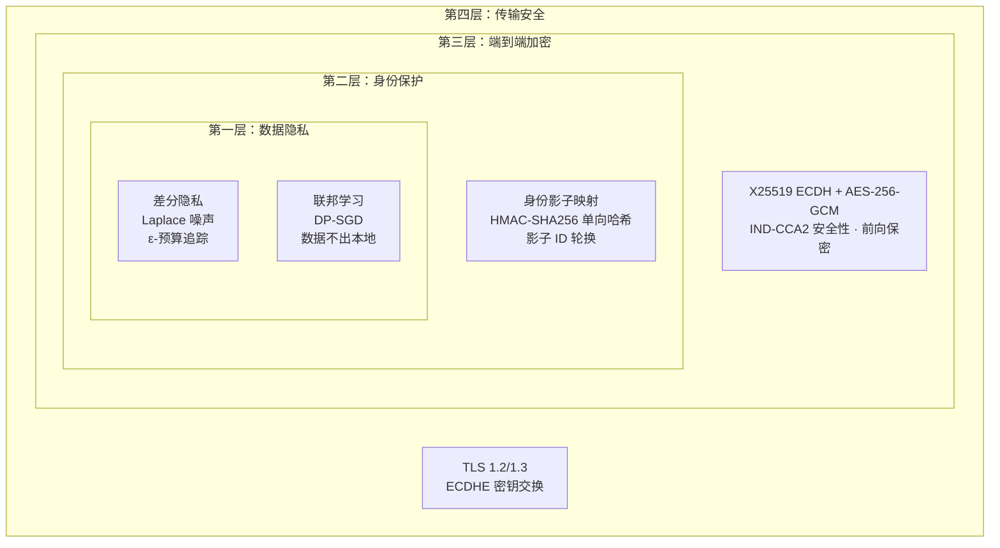
```mermaid
graph TB
    subgraph Layer4["第四层：传输安全"]
        TLS["TLS 1.2/1.3<br/>ECDHE 密钥交换"]
        subgraph Layer3["第三层：端到端加密"]
            E2E["X25519 ECDH + AES-256-GCM<br/>IND-CCA2 安全性 · 前向保密"]
            subgraph Layer2["第二层：身份保护"]
                Shadow["身份影子映射<br/>HMAC-SHA256 单向哈希<br/>影子 ID 轮换"]
                subgraph Layer1["第一层：数据隐私"]
                    DP["差分隐私<br/>Laplace 噪声<br/>ε-预算追踪"]
                    FL["联邦学习<br/>DP-SGD<br/>数据不出本地"]
                end
            end
        end
    end
```

### 4.2 各层详解

#### 第一层：数据隐私（差分隐私 + 联邦学习）

- 情感统计数据添加 Laplace 噪声后才可查询
- 联邦学习确保原始数据不离开本地
- DP-SGD 在训练过程中注入高斯噪声

#### 第二层：身份保护（影子映射）

```cpp
// IdentityShadowMap.h
struct ShadowIdentity {
    std::string shadowId;        // HMAC-SHA256 生成的影子 ID
    std::string hashedIp;        // IP 地址匿名化
    std::string hashedFingerprint; // 设备指纹匿名化
};
```

- **HMAC-SHA256 单向哈希**: 真实用户 ID → 不可逆的影子 ID
- **影子 ID 轮换**: 定期更换影子 ID，防止长期追踪
- **IP / 指纹匿名化**: 所有标识信息单向哈希处理

#### 第三层：端到端加密

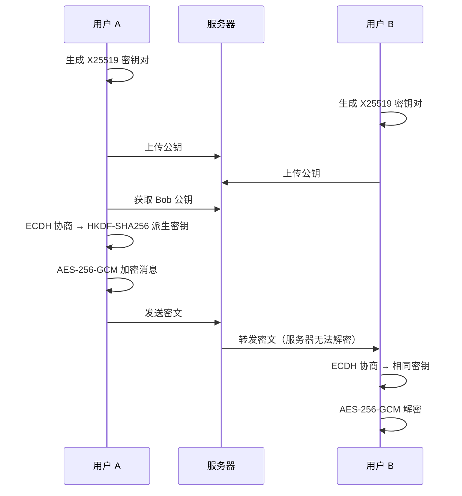
```mermaid
sequenceDiagram
    participant Alice as 用户 A
    participant Server as 服务器
    participant Bob as 用户 B

    Alice->>Alice: 生成 X25519 密钥对
    Bob->>Bob: 生成 X25519 密钥对

    Alice->>Server: 上传公钥
    Bob->>Server: 上传公钥

    Alice->>Server: 获取 Bob 公钥
    Alice->>Alice: ECDH 协商 → HKDF-SHA256 派生密钥
    Alice->>Alice: AES-256-GCM 加密消息

    Alice->>Server: 发送密文
    Server->>Bob: 转发密文（服务器无法解密）

    Bob->>Bob: ECDH 协商 → 相同密钥
    Bob->>Bob: AES-256-GCM 解密
```

| 参数 | 值 | 说明 |
|------|-----|------|
| KEY_SIZE | 32 字节 | AES-256 密钥长度 |
| IV_SIZE | 12 字节 | GCM 随机数长度 |
| TAG_SIZE | 16 字节 | 认证标签长度 |
| 密钥交换 | X25519 ECDH | 椭圆曲线 Diffie-Hellman |
| 密钥派生 | HKDF-SHA256 | 基于 HMAC 的密钥派生 |
| 加密算法 | AES-256-GCM | AEAD 认证加密 |
| 安全性 | IND-CCA2 | 选择密文攻击安全 |
| 前向保密 | ✅ | 临时密钥对，历史消息不可追溯 |

#### 第四层：传输安全

- TLS 1.2 / 1.3 强制加密
- ECDHE 密钥交换，支持前向保密
- HSTS 头部: `max-age=31536000; includeSubDomains; preload`

---

## 5. 安全架构

> 从认证到传输，构建纵深防御体系。

### 5.1 安全架构总览图

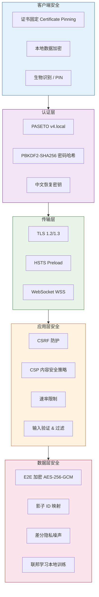
```mermaid
graph TB
    subgraph Client["客户端安全"]
        C1[证书固定 Certificate Pinning]
        C2[本地数据加密]
        C3[生物识别 / PIN]
    end

    subgraph Auth["认证层"]
        A1[PASETO v4.local]
        A2[PBKDF2-SHA256 密码哈希]
        A3[中文恢复密钥]
    end

    subgraph Transport["传输层"]
        T1[TLS 1.2/1.3]
        T2[HSTS Preload]
        T3[WebSocket WSS]
    end

    subgraph AppSec["应用层安全"]
        S1[CSRF 防护]
        S2[CSP 内容安全策略]
        S3[速率限制]
        S4[输入验证 & 过滤]
    end

    subgraph DataSec["数据层安全"]
        D1[E2E 加密 AES-256-GCM]
        D2[影子 ID 映射]
        D3[差分隐私噪声]
        D4[联邦学习本地训练]
    end

    Client --> Auth --> Transport --> AppSec --> DataSec

    style Client fill:#e3f2fd,stroke:#1565c0
    style Auth fill:#f3e5f5,stroke:#7b1fa2
    style Transport fill:#e8f5e9,stroke:#2e7d32
    style AppSec fill:#fff3e0,stroke:#e65100
    style DataSec fill:#fce4ec,stroke:#c62828
```

### 5.2 认证体系

#### PASETO v4.local 令牌

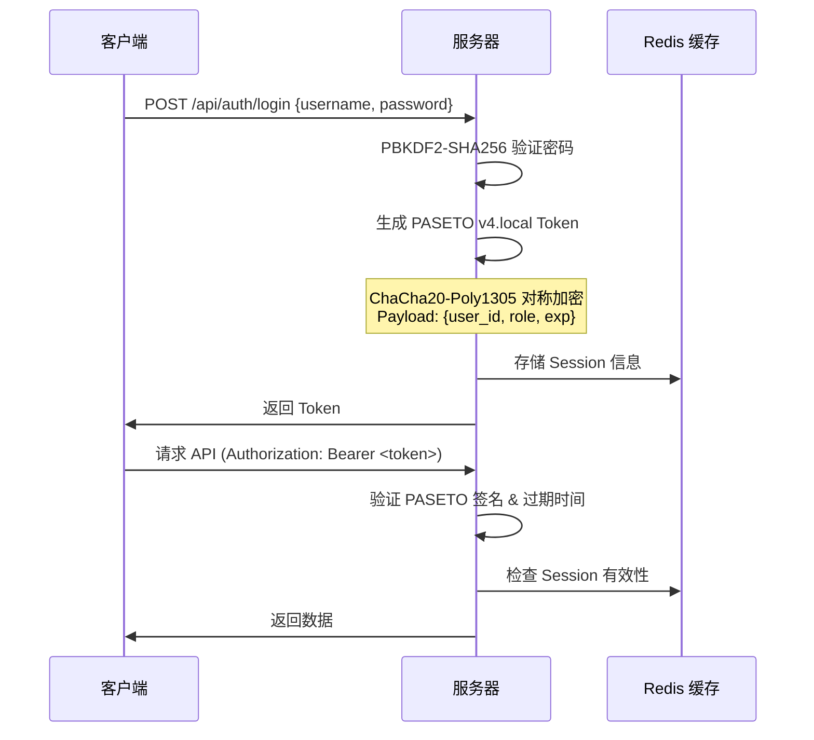
```mermaid
sequenceDiagram
    participant Client as 客户端
    participant Server as 服务器
    participant Redis as Redis 缓存

    Client->>Server: POST /api/auth/login {username, password}
    Server->>Server: PBKDF2-SHA256 验证密码
    Server->>Server: 生成 PASETO v4.local Token
    Note over Server: ChaCha20-Poly1305 对称加密<br/>Payload: {user_id, role, exp}
    Server->>Redis: 存储 Session 信息
    Server->>Client: 返回 Token

    Client->>Server: 请求 API (Authorization: Bearer <token>)
    Server->>Server: 验证 PASETO 签名 & 过期时间
    Server->>Redis: 检查 Session 有效性
    Server->>Client: 返回数据
```

| 组件 | 技术方案 | 参数 |
|------|----------|------|
| 令牌格式 | PASETO v4.local | ChaCha20-Poly1305 |
| 密钥长度 | 32 字节 | 256-bit 对称密钥 |
| 密码哈希 | PBKDF2-SHA256 | 100,000 次迭代 |
| 盐值长度 | 32 字节 | 密码学安全随机 |
| 哈希输出 | 64 字节 | 512-bit |
| 恢复密钥 | 6 个中文词 | 256 词表 → 48-bit 熵 |

#### 中文恢复密钥

独创的中文恢复密钥方案，从 256 个精选中文词汇中随机选取 6 个组成恢复密钥：

```
示例: 春风 - 明月 - 星河 - 碧海 - 云帆 - 晨曦
熵值: log2(256^6) = 48 bits
```

相比传统英文助记词，中文恢复密钥对中文用户更友好、更易记忆。

### 5.3 Nginx 安全加固

#### 速率限制策略


```mermaid
graph LR
    subgraph RateLimits["速率限制区域"]
        R1["api: 30 req/s<br/>通用 API"]
        R2["login: 5 req/min<br/>登录接口"]
        R3["ws: 10 req/s<br/>WebSocket"]
        R4["ai_api: 5 req/s<br/>AI 接口"]
    end

    subgraph ConnLimits["连接限制"]
        CL1["ws_conn: 10m<br/>WebSocket 并发连接"]
    end

    subgraph Headers["安全响应头"]
        H1["X-Frame-Options: DENY"]
        H2["X-Content-Type-Options: nosniff"]
        H3["X-XSS-Protection: 1; mode=block"]
        H4["Referrer-Policy: strict-origin-when-cross-origin"]
        H5["HSTS: max-age=31536000"]
        H6["CSP: default-src 'self'"]
    end

    RateLimits --> ConnLimits --> Headers
```

#### Content-Security-Policy 详解

```
default-src 'self';
script-src 'self' 'unsafe-inline';
style-src 'self' 'unsafe-inline';
img-src 'self' data: blob:;
font-src 'self' data:;
connect-src 'self' wss: ws:;
frame-ancestors 'none';
base-uri 'self';
form-action 'self';
```

---

## 6. 数据流图

> 追踪核心业务数据的完整生命周期。

### 6.1 心石发布流程

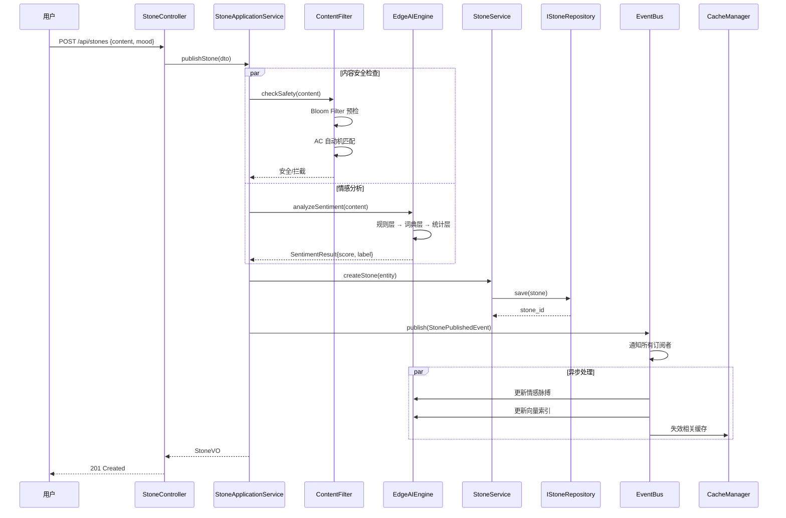
```mermaid
sequenceDiagram
    participant User as 用户
    participant Ctrl as StoneController
    participant App as StoneApplicationService
    participant Filter as ContentFilter
    participant AI as EdgeAIEngine
    participant Domain as StoneService
    participant Repo as IStoneRepository
    participant Bus as EventBus
    participant Cache as CacheManager

    User->>Ctrl: POST /api/stones {content, mood}
    Ctrl->>App: publishStone(dto)

    par 内容安全检查
        App->>Filter: checkSafety(content)
        Filter->>Filter: Bloom Filter 预检
        Filter->>Filter: AC 自动机匹配
        Filter-->>App: 安全/拦截
    and 情感分析
        App->>AI: analyzeSentiment(content)
        AI->>AI: 规则层 → 词典层 → 统计层
        AI-->>App: SentimentResult{score, label}
    end

    App->>Domain: createStone(entity)
    Domain->>Repo: save(stone)
    Repo-->>Domain: stone_id

    App->>Bus: publish(StonePublishedEvent)
    Bus->>Bus: 通知所有订阅者

    par 异步处理
        Bus->>AI: 更新情感脉搏
        Bus->>AI: 更新向量索引
        Bus->>Cache: 失效相关缓存
    end

    App-->>Ctrl: StoneVO
    Ctrl-->>User: 201 Created
```

### 6.2 情感共鸣匹配流程

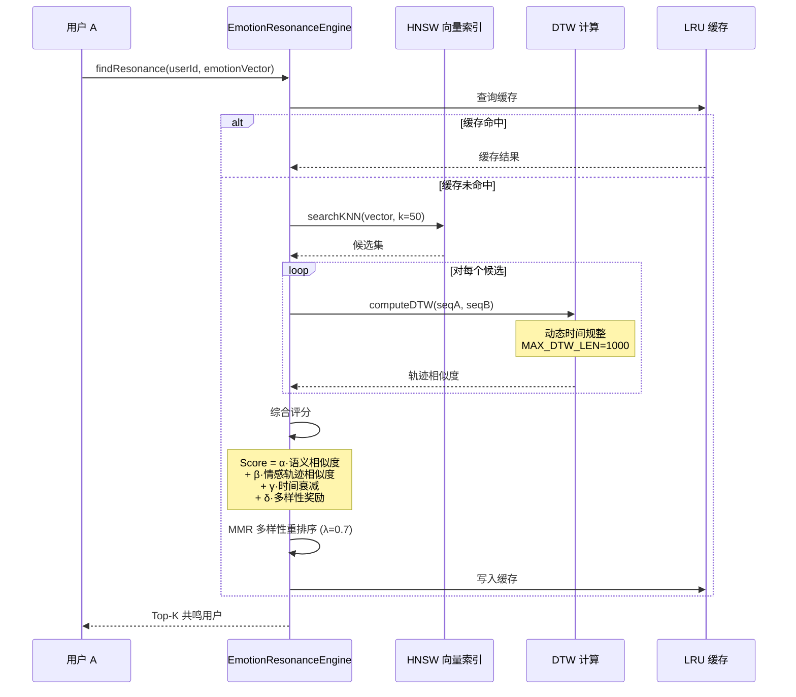
```mermaid
sequenceDiagram
    participant User as 用户 A
    participant Engine as EmotionResonanceEngine
    participant HNSW as HNSW 向量索引
    participant DTW as DTW 计算
    participant Cache as LRU 缓存

    User->>Engine: findResonance(userId, emotionVector)

    Engine->>Cache: 查询缓存
    alt 缓存命中
        Cache-->>Engine: 缓存结果
    else 缓存未命中
        Engine->>HNSW: searchKNN(vector, k=50)
        HNSW-->>Engine: 候选集

        loop 对每个候选
            Engine->>DTW: computeDTW(seqA, seqB)
            Note over DTW: 动态时间规整<br/>MAX_DTW_LEN=1000
            DTW-->>Engine: 轨迹相似度
        end

        Engine->>Engine: 综合评分
        Note over Engine: Score = α·语义相似度<br/>+ β·情感轨迹相似度<br/>+ γ·时间衰减<br/>+ δ·多样性奖励

        Engine->>Engine: MMR 多样性重排序 (λ=0.7)
        Engine->>Cache: 写入缓存
    end

    Engine-->>User: Top-K 共鸣用户
```

### 6.3 推荐引擎数据流

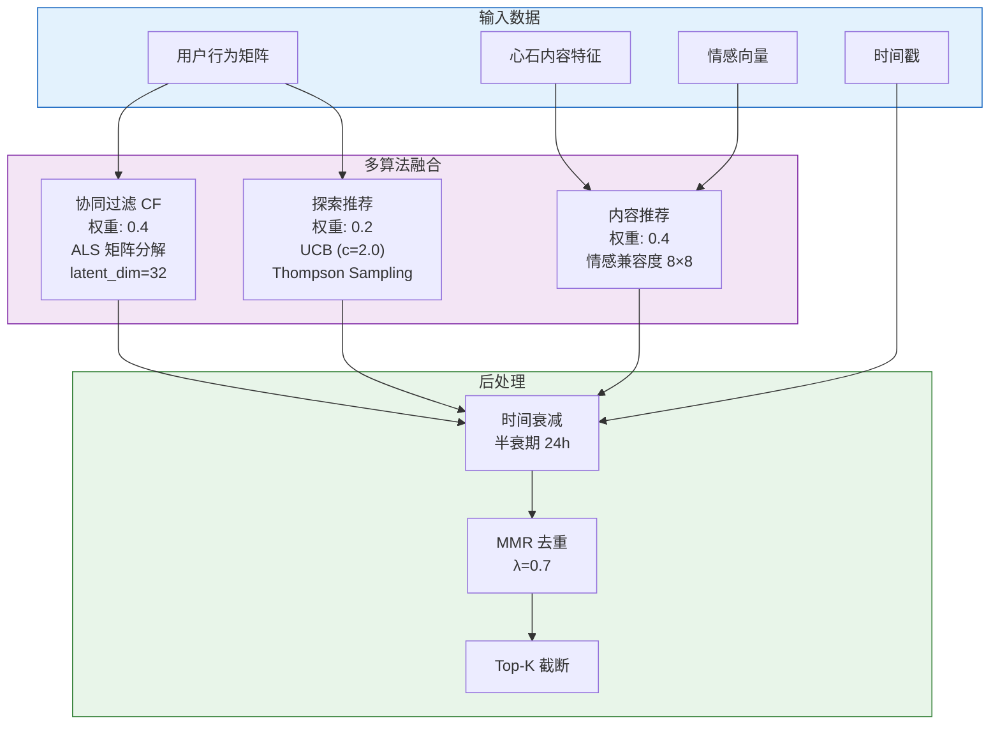
```mermaid
graph TB
    subgraph Input["输入数据"]
        I1[用户行为矩阵]
        I2[心石内容特征]
        I3[情感向量]
        I4[时间戳]
    end

    subgraph Algorithms["多算法融合"]
        A1["协同过滤 CF<br/>权重: 0.4<br/>ALS 矩阵分解<br/>latent_dim=32"]
        A2["内容推荐<br/>权重: 0.4<br/>情感兼容度 8×8"]
        A3["探索推荐<br/>权重: 0.2<br/>UCB (c=2.0)<br/>Thompson Sampling"]
    end

    subgraph PostProcess["后处理"]
        P1["时间衰减<br/>半衰期 24h"]
        P2["MMR 去重<br/>λ=0.7"]
        P3["Top-K 截断"]
    end

    I1 --> A1
    I2 --> A2
    I3 --> A2
    I1 --> A3
    I4 --> P1

    A1 --> P1
    A2 --> P1
    A3 --> P1
    P1 --> P2 --> P3

    style Input fill:#e3f2fd,stroke:#1565c0
    style Algorithms fill:#f3e5f5,stroke:#7b1fa2
    style PostProcess fill:#e8f5e9,stroke:#2e7d32
```

### 6.4 双记忆 RAG 数据流

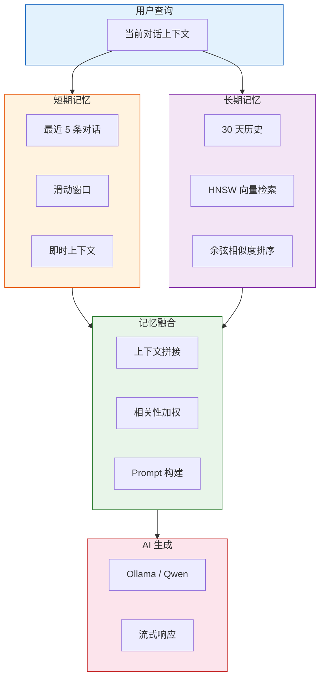
```mermaid
graph TB
    subgraph Query["用户查询"]
        Q1[当前对话上下文]
    end

    subgraph ShortTerm["短期记忆"]
        ST1["最近 5 条对话"]
        ST2["滑动窗口"]
        ST3["即时上下文"]
    end

    subgraph LongTerm["长期记忆"]
        LT1["30 天历史"]
        LT2["HNSW 向量检索"]
        LT3["余弦相似度排序"]
    end

    subgraph Fusion["记忆融合"]
        F1["上下文拼接"]
        F2["相关性加权"]
        F3["Prompt 构建"]
    end

    subgraph LLM["AI 生成"]
        L1["Ollama / Qwen"]
        L2["流式响应"]
    end

    Q1 --> ShortTerm
    Q1 --> LongTerm
    ShortTerm --> Fusion
    LongTerm --> Fusion
    Fusion --> LLM

    style Query fill:#e3f2fd,stroke:#1565c0
    style ShortTerm fill:#fff3e0,stroke:#e65100
    style LongTerm fill:#f3e5f5,stroke:#7b1fa2
    style Fusion fill:#e8f5e9,stroke:#2e7d32
    style LLM fill:#fce4ec,stroke:#c62828
```

---

## 7. 部署架构

> Docker Compose 编排，一键部署全栈服务。

### 7.1 部署拓扑图

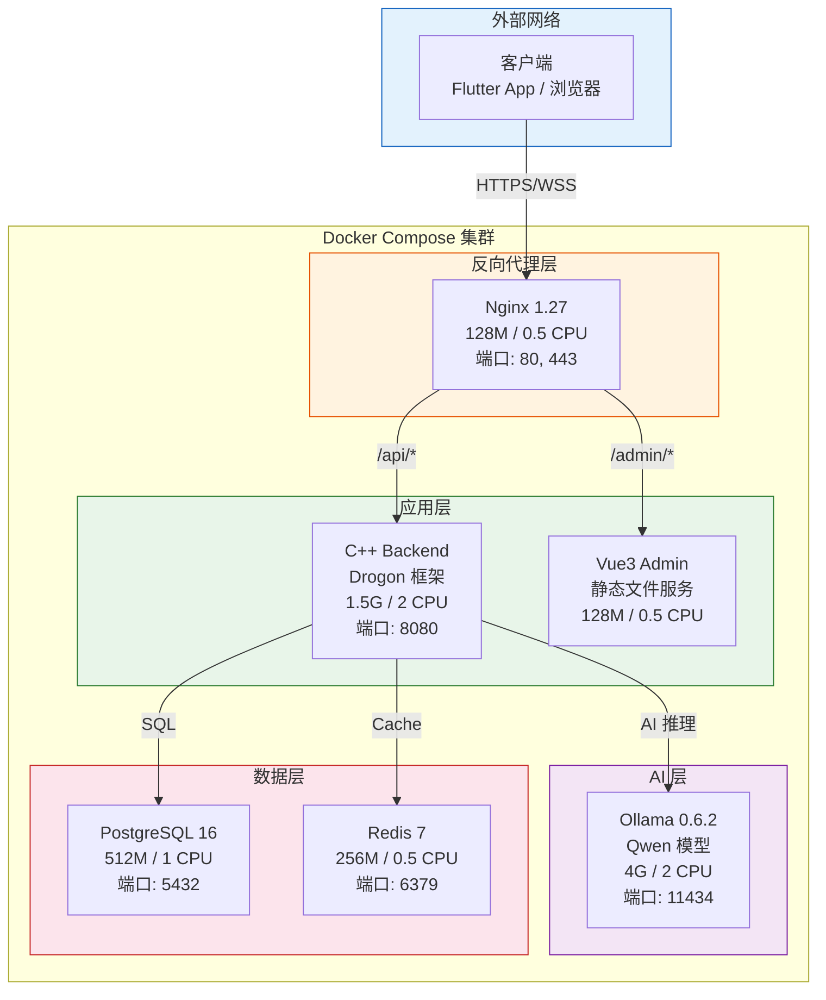
```mermaid
graph TB
    subgraph Internet["外部网络"]
        Client[客户端<br/>Flutter App / 浏览器]
    end

    subgraph Docker["Docker Compose 集群"]
        subgraph Proxy["反向代理层"]
            Nginx["Nginx 1.27<br/>128M / 0.5 CPU<br/>端口: 80, 443"]
        end

        subgraph App["应用层"]
            Backend["C++ Backend<br/>Drogon 框架<br/>1.5G / 2 CPU<br/>端口: 8080"]
            Admin["Vue3 Admin<br/>静态文件服务<br/>128M / 0.5 CPU"]
        end

        subgraph AI["AI 层"]
            Ollama["Ollama 0.6.2<br/>Qwen 模型<br/>4G / 2 CPU<br/>端口: 11434"]
        end

        subgraph Data["数据层"]
            PG["PostgreSQL 16<br/>512M / 1 CPU<br/>端口: 5432"]
            Redis["Redis 7<br/>256M / 0.5 CPU<br/>端口: 6379"]
        end
    end

    Client -->|HTTPS/WSS| Nginx
    Nginx -->|/api/*| Backend
    Nginx -->|/admin/*| Admin
    Backend -->|SQL| PG
    Backend -->|Cache| Redis
    Backend -->|AI 推理| Ollama

    style Internet fill:#e3f2fd,stroke:#1565c0
    style Proxy fill:#fff3e0,stroke:#e65100
    style App fill:#e8f5e9,stroke:#2e7d32
    style AI fill:#f3e5f5,stroke:#7b1fa2
    style Data fill:#fce4ec,stroke:#c62828
```

### 7.2 服务资源分配

| 服务 | 镜像 | 内存限制 | CPU 限制 | 端口 | 健康检查 |
|------|------|----------|----------|------|----------|
| PostgreSQL | postgres:16-alpine | 512M | 1.0 | 5432 | pg_isready |
| Redis | redis:7-alpine | 256M | 0.5 | 6379 | redis-cli ping |
| Ollama | ollama/ollama:0.6.2 | 4G | 2.0 | 11434 | curl /api/tags |
| Backend | 自定义构建 | 1.5G | 2.0 | 8080 | curl /api/health |
| Admin | 自定义构建 | 128M | 0.5 | - | service_started |
| Nginx | nginx:1.27-alpine | 128M | 0.5 | 80, 443 | curl /nginx-health |
| **合计** | | **6.5G** | **6.5 CPU** | | |

### 7.3 服务依赖与启动顺序

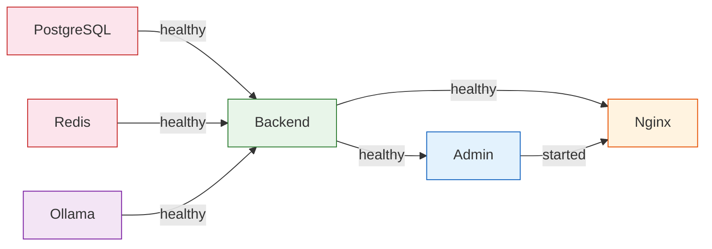
```mermaid
graph LR
    PG[PostgreSQL] -->|healthy| Backend
    Redis[Redis] -->|healthy| Backend
    Ollama[Ollama] -->|healthy| Backend
    Backend -->|healthy| Admin
    Backend -->|healthy| Nginx
    Admin -->|started| Nginx

    style PG fill:#fce4ec,stroke:#c62828
    style Redis fill:#fce4ec,stroke:#c62828
    style Ollama fill:#f3e5f5,stroke:#7b1fa2
    style Backend fill:#e8f5e9,stroke:#2e7d32
    style Admin fill:#e3f2fd,stroke:#1565c0
    style Nginx fill:#fff3e0,stroke:#e65100
```

启动顺序：PostgreSQL / Redis / Ollama（并行启动）→ Backend（等待三者 healthy）→ Admin + Nginx

### 7.4 数据持久化

```mermaid
graph LR
    subgraph Volumes["Docker Named Volumes"]
        V1["pgdata<br/>PostgreSQL 数据"]
        V2["redisdata<br/>Redis AOF 持久化"]
        V3["backend-uploads<br/>用户上传文件"]
        V4["backend-logs<br/>应用日志"]
        V5["backend-models<br/>ONNX 模型文件"]
        V6["ollama-models<br/>LLM 模型权重"]
    end

    subgraph BindMounts["绑定挂载"]
        B1["nginx.conf<br/>只读挂载"]
        B2["conf.d/<br/>只读挂载"]
    end

    style Volumes fill:#e8f5e9,stroke:#2e7d32
    style BindMounts fill:#fff3e0,stroke:#e65100
```

### 7.5 网络架构

所有服务通过 `heartlake-net` Bridge 网络互联，外部端口绑定 `127.0.0.1` 防止意外暴露：

| 服务 | 外部绑定 | 说明 |
|------|----------|------|
| PostgreSQL | 127.0.0.1:5432 | 仅本地访问 |
| Redis | 127.0.0.1:6379 | 仅本地访问 |
| Ollama | 127.0.0.1:11434 | 仅本地访问 |
| Backend | 127.0.0.1:8080 | 仅本地访问 |
| Nginx | 0.0.0.0:80/443 | 对外服务入口 |

---

## 8. 性能设计

> 从算法到系统，全链路性能优化。

### 8.1 性能优化全景

```mermaid
graph TB
    subgraph Algorithm["算法层优化"]
        AL1["HNSW 向量索引<br/>O(log n) 近似最近邻"]
        AL2["AC 自动机<br/>O(n) 多模式匹配"]
        AL3["Bloom Filter 预检<br/>O(1) 快速否定"]
        AL4["INT8 量化<br/>推理加速 2-4x"]
    end

    subgraph Cache["缓存层优化"]
        CA1["分片 LRU 缓存<br/>减少锁竞争"]
        CA2["Redis 热点缓存<br/>allkeys-lru 256MB"]
        CA3["HNSW LRU 缓存<br/>10,000 条向量"]
    end

    subgraph System["系统层优化"]
        SY1["Nginx Gzip 压缩<br/>level 6"]
        SY2["TCP 优化<br/>sendfile + tcp_nopush"]
        SY3["连接池复用<br/>keepalive 65s"]
        SY4["多线程 ONNX<br/>2 线程推理"]
    end

    subgraph Concurrency["并发控制"]
        CO1["shared_mutex<br/>读写锁分离"]
        CO2["分片锁<br/>降低竞争"]
        CO3["异步事件总线<br/>非阻塞发布"]
        CO4["速率限制<br/>防止过载"]
    end

    Algorithm --> Cache --> System --> Concurrency

    style Algorithm fill:#e3f2fd,stroke:#1565c0
    style Cache fill:#f3e5f5,stroke:#7b1fa2
    style System fill:#e8f5e9,stroke:#2e7d32
    style Concurrency fill:#fff3e0,stroke:#e65100
```

### 8.2 HNSW 向量索引性能

```mermaid
graph LR
    subgraph Params["核心参数"]
        P1["DIM = 128<br/>向量维度"]
        P2["M = 16<br/>每层连接数"]
        P3["M_MAX0 = 32<br/>底层最大连接"]
        P4["EF_CONSTRUCTION = 200<br/>构建精度"]
        P5["EF_SEARCH = 50<br/>搜索精度"]
        P6["MAX_ELEMENTS = 10,000<br/>最大容量"]
    end

    subgraph Performance["性能指标"]
        PE1["搜索复杂度: O(log n)"]
        PE2["插入复杂度: O(log n)"]
        PE3["内存: ~10MB (10K×128D)"]
        PE4["LRU 缓存: 10,000 条"]
    end

    Params --> Performance

    style Params fill:#e3f2fd,stroke:#1565c0
    style Performance fill:#e8f5e9,stroke:#2e7d32
```

### 8.3 内容过滤性能

ContentFilter 采用三级加速架构：

```
请求 → Counting Bloom Filter (O(1) 预检)
         ↓ 可能存在
       AC 自动机 (O(n) 精确匹配)
         ↓ 命中
       Sharded LRU Cache (缓存热点结果)
```

| 组件 | 时间复杂度 | 空间复杂度 | 说明 |
|------|-----------|-----------|------|
| Bloom Filter | O(k) ≈ O(1) | O(m) | k 个哈希函数，m 位数组 |
| AC 自动机 | O(n + z) | O(Σ\|p\|) | n=文本长度，z=匹配数 |
| Sharded LRU | O(1) 均摊 | O(capacity) | 分片降低锁竞争 |
| 白名单 | O(1) | O(w) | unordered_set 查找 |

### 8.4 缓存策略

```mermaid
graph TB
    subgraph L1["L1: 进程内缓存"]
        L1A["Sharded LRU Cache<br/>ContentFilter 结果"]
        L1B["HNSW LRU Cache<br/>向量搜索结果"]
        L1C["CacheManager<br/>业务数据缓存"]
    end

    subgraph L2["L2: Redis 缓存"]
        L2A["Session 缓存"]
        L2B["热点数据缓存"]
        L2C["限流计数器"]
    end

    subgraph L3["L3: 数据库"]
        L3A["PostgreSQL 16"]
    end

    L1 -->|未命中| L2 -->|未命中| L3

    style L1 fill:#e8f5e9,stroke:#2e7d32
    style L2 fill:#fff3e0,stroke:#e65100
    style L3 fill:#fce4ec,stroke:#c62828
```

Redis 配置：
- 最大内存: 256MB
- 淘汰策略: allkeys-lru
- 持久化: AOF (appendonly yes)

### 8.5 并发与线程安全

| 组件 | 锁策略 | 说明 |
|------|--------|------|
| ServiceLocator | recursive_mutex | 支持递归注册 |
| EventBus | shared_mutex | 读多写少，快照发布 |
| ContentFilter | mutex | 初始化互斥 |
| HNSW Index | shared_mutex | 并发读，互斥写 |
| EdgeAIEngine | shared_mutex | 子系统级读写锁 |
| Sharded LRU | 分片 mutex | 降低锁竞争 |

### 8.6 Nginx 性能调优

```
worker_processes auto;          # 自动匹配 CPU 核心数
worker_connections 1024;        # 每 worker 最大连接
multi_accept on;                # 一次接受多个连接

sendfile on;                    # 零拷贝文件传输
tcp_nopush on;                  # 优化数据包发送
tcp_nodelay on;                 # 禁用 Nagle 算法
keepalive_timeout 65;           # 长连接超时

gzip on;                        # 启用压缩
gzip_comp_level 6;              # 压缩级别 (1-9)
gzip_types text/plain text/css application/json
           application/javascript text/xml;
```

---

## 附录

### A. 技术栈版本清单

| 技术 | 版本 | 用途 |
|------|------|------|
| C++ | C++20 | 后端开发语言 |
| Drogon | latest | HTTP 框架 |
| Flutter | latest | 移动端框架 |
| Vue 3 | 3.x | 管理后台框架 |
| Vite | latest | 前端构建工具 |
| Element Plus | latest | UI 组件库 |
| PostgreSQL | 16-alpine | 关系型数据库 |
| Redis | 7-alpine | 缓存 & 消息 |
| Ollama | 0.6.2 | 本地 LLM 服务 |
| Nginx | 1.27-alpine | 反向代理 |
| ONNX Runtime | latest | 边缘 AI 推理 |
| libsodium | latest | 加密库 |

### B. 代码统计

| 模块 | 语言 | 代码行数 | 说明 |
|------|------|----------|------|
| EdgeAI Engine | C++ | ~4,200 行 | 8 大子系统实现 |
| EdgeAI Headers | C++ | ~2,400 行 | 接口定义 |
| Backend 总计 | C++ | ~10,000+ 行 | 含控制器、服务、领域 |
| Admin | Vue/TS | ~5,000+ 行 | 管理后台 |
| Flutter | Dart | ~8,000+ 行 | 移动端 |
| 测试 | C++ | 69+ 用例 | 6 个测试文件 |

### C. 参考文献

1. Eric Evans, *Domain-Driven Design: Tackling Complexity in the Heart of Software*, 2003
2. Malkov & Yashunin, *Efficient and Robust Approximate Nearest Neighbor using Hierarchical Navigable Small World Graphs*, 2018
3. Aho & Corasick, *Efficient String Matching: An Aid to Bibliographic Search*, 1975
4. Dwork & Roth, *The Algorithmic Foundations of Differential Privacy*, 2014
5. McMahan et al., *Communication-Efficient Learning of Deep Networks from Decentralized Data*, 2017
6. PASETO: Platform-Agnostic Security Tokens, https://paseto.io/

---

> 📌 本文档基于源代码自动分析生成，所有参数均来自实际代码实现。
>
> 最后更新: 2026-02-25 | HeartLake v1.0
